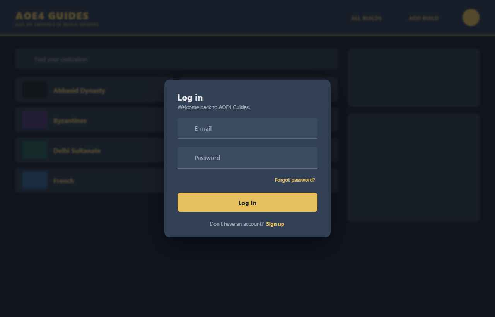
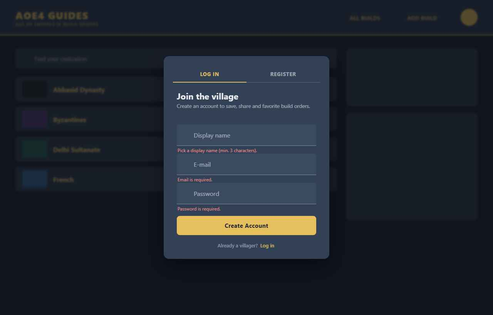
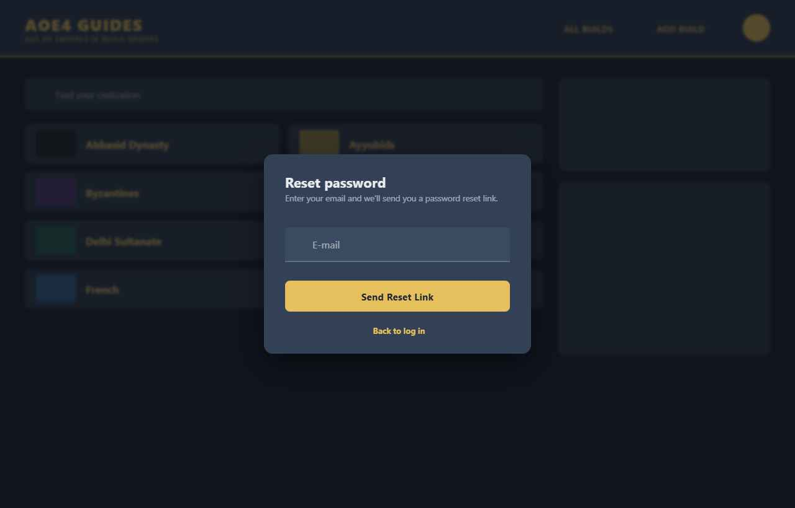
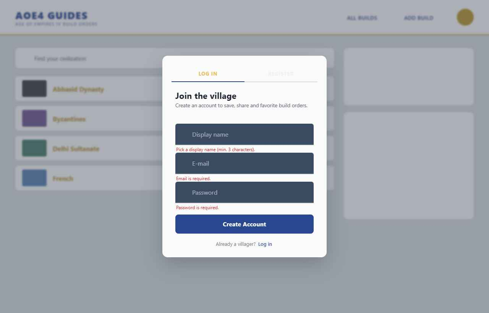

# Design Notes — Mock → Code Bridge

This file makes the implementation mechanical. It captures the **approved** design decisions from the interactive mock (`Auth Redesign.html`) and translates them into concrete copy, tokens, a component contract, and the error map.

**Approved direction**: `link` switcher · `plain` voice · dialog-over-context · email/password only. Three modes: **login / register / reset**.

---

## 1. Component contract — `src/components/account/AuthDialog.vue`

A single globally-mounted modal. State for visibility/mode comes from Vuex (so the header and router can open it); the form state is local.

**Reads (Vuex):**
- `store.state.ui.authDialog.visible` → `v-model` of the `v-dialog`
- `store.state.ui.authDialog.mode` → `'login' | 'register' | 'reset'`

**Writes (Vuex):**
- `openAuthDialog(mode)` / `closeAuthDialog()` actions
- existing `signin({ email, password })`, `signup({ email, password, displayName })`
- new `resetPassword({ email })` action (thin wrapper over `sendPasswordResetEmail`, see §5)
- existing `showSnackbar({ text, type })`

**Local state:** `displayName`, `email`, `password`, `showPassword`, `loading`, `authError` (mapped string), plus `v-form` ref + field rules. `mode` may be local mirror of the store mode, or driven straight off the store.

**Behavior:**
- Default mode `login`. Footer link calls a local `switchMode()` that flips mode, clears `authError`, and resets validation (keep typed email/password).
- The login "Forgot password?" link calls `switchMode('reset')` (it does **not** navigate).
- Submit (mode-aware): run `form.validate()`; if valid set `loading=true`, dispatch `signin`/`signup`/`resetPassword`, on success `closeAuthDialog()` (or, for reset, snackbar + return to `login`); on error set `authError = mapAuthError(err)`. Always clear `loading` in `finally`.
- `v-dialog` props: `max-width="430"`, `persistent="false"` (scrim + Esc close), `transition` default. Wrap in `<v-card rounded="lg">`.
- Honor reduced motion: rely on Vuetify's default transition (respects user settings) — do not add custom infinite animation.

**Layout (top → bottom):**
1. Close button (`v-btn icon variant="text"`, `mdi-close`) top-right.
2. Title (`v-card-title`): `Log in` / `Create account` / `Reset password`.
3. Subtitle (`v-card-subtitle`): see copy below.
4. Error banner (`v-alert type="error" variant="tonal" density="comfortable"`) — only when `authError` (login/register).
5. `v-form`:
   - register only: Display name (`v-text-field`, prepend-inner `mdi-account-outline`)
   - E-mail (`v-text-field type="email"`, prepend-inner `mdi-email-outline`) — all three modes
   - **not in reset**: Password (`v-text-field`, prepend-inner `mdi-lock-outline`, append-inner eye toggle `mdi-eye-outline`/`mdi-eye-off-outline`, `:type="showPassword ? 'text' : 'password'"`)
   - login only: "Forgot password?" `v-btn variant="text"` → `switchMode('reset')`
   - Submit `v-btn block color="primary" :loading="loading" :disabled="loading"`
6. Footer switch line (centered, `text-medium-emphasis`):
   - login: "Don't have an account? **Sign up**" → register
   - register: "Already have an account? **Log in**" → login
   - reset: "← **Back to log in**" → login

---

## 2. Copy (plain voice — verbatim)

| Slot | Login mode | Register mode | Reset mode |
|---|---|---|---|
| Title | `Log in` | `Create account` | `Reset password` |
| Subtitle | `Welcome back to AOE4 Guides.` | `Join AOE4 Guides to save and share build orders.` | `Enter your email and we'll send you a password reset link.` |
| Submit button | `Log In` | `Create Account` | `Send Reset Link` |
| Footer | `Don't have an account?` **Sign up** | `Already have an account?` **Log in** | ← **Back to log in** |
| Forgot link (login only) | `Forgot password?` → switches to Reset mode | — | — |
| Success snackbar | `Logged in successfully!` | `Verification email sent to {email}.` | `Reset email sent to {email}.` → return to Login |

---

## 3. Field rules

```js
const emailRules = [
  v => !!v || 'Email is required.',
  v => /^[^\s@]+@[^\s@]+\.[^\s@]+$/.test(v) || 'Enter a valid email address.',
];
const passwordLoginRules = [ v => !!v || 'Password is required.' ];
const passwordRegisterRules = [
  v => !!v || 'Password is required.',
  v => (v && v.length >= 6) || 'Use at least 6 characters.',
];
const displayNameRules = [
  v => !!v || 'Display name is required.',
  v => (v && v.trim().length >= 3) || 'Pick a display name (min. 3 characters).',
];
// Reset mode validates email only.
```

> 6 is Firebase Auth's minimum password length — keep client and backend in agreement.

---

## 4. Friendly error map — `src/composables/auth/useAuthErrors.js`

The existing actions throw `new Error("Could not signin: " + error.code)`. Map on the **code substring** so it works whether you pass the raw code or the wrapped message.

```js
const MESSAGES = {
  'auth/invalid-credential':     'Incorrect email or password. Please try again.',
  'auth/wrong-password':         'Incorrect email or password. Please try again.',
  'auth/user-not-found':         'Incorrect email or password. Please try again.',
  'auth/invalid-email':          'Enter a valid email address.',
  'auth/user-disabled':          'This account has been disabled.',
  'auth/too-many-requests':      'Too many attempts. Please wait a moment and try again.',
  'auth/email-already-in-use':   'An account with this email already exists.',
  'auth/weak-password':          'Use a stronger password (at least 6 characters).',
  'auth/network-request-failed': 'Network error. Check your connection and try again.',
};

export function mapAuthError(errOrCode) {
  const s = (errOrCode?.message || errOrCode || '').toString();
  const hit = Object.keys(MESSAGES).find(code => s.includes(code));
  return hit ? MESSAGES[hit] : 'Something went wrong. Please try again.';
}
```

> Optional cleanup (Constitution II): have `store` actions re-throw the original Firebase error (or attach `error.code`) instead of string-concatenating, so the map keys match exactly. Low-risk refactor; do as a separate commit.

For `auth/email-already-in-use`, render a "Log in instead" `v-btn variant="text"` next to the banner that calls `switchMode('login')`.

---

## 5. Vuex UI slice (add to `src/store/index.js`)

```js
// state
ui: { authDialog: { visible: false, mode: 'login', redirect: null } },

// mutations
setAuthDialog(state, payload) { state.ui.authDialog = { ...state.ui.authDialog, ...payload }; },

// actions
openAuthDialog({ commit }, { mode = 'login', redirect = null } = {}) {
  commit('setAuthDialog', { visible: true, mode, redirect });
},
closeAuthDialog({ commit }) { commit('setAuthDialog', { visible: false, redirect: null }); },
```

Mirrors the existing flat state style (`showBottomNavigation`, `snackbar`).

Add a `resetPassword` action next to `signin`/`signup` (the current `ResetPassword.vue` calls `sendPasswordResetEmail` inline — move it into the store for consistency):

```js
async resetPassword(_, { email }) {
  const actionCodeSettings = { url: 'https://aoe4guides.com/login' };
  await sendPasswordResetEmail(auth, email, actionCodeSettings)
    .catch((error) => { throw new Error('Could not send reset email: ' + error.code); });
}
```

(`sendPasswordResetEmail` is already exported from `src/firebase/index.js`.)

---

## 6. Header change (`src/components/Header.vue`)

Replace the logged-out pair ("New Villager? REGISTER NOW!" + "Login") with a **single** action:

```html
<v-btn variant="text" color="primary" prepend-icon="mdi-login"
       @click="store.dispatch('openAuthDialog', 'login')">
  Log in
</v-btn>
```

(Keep the authenticated-state header exactly as-is.)

---

## 7. Router change (`src/router/index.js`)

Keep `/login`, `/register`, and `/resetpassword` resolvable (verification emails link to `/login`). Two options — pick the simpler that fits the router style:

- **Preferred**: route components become tiny shims whose `beforeRouteEnter`/`setup` dispatches `openAuthDialog('login'|'register'|'reset')` then `next('/')` (redirect home, dialog open over it).
- Add a global guard: if an authenticated user hits `/login` or `/register`, redirect to `/` without opening the dialog (FR-012).

Retire `Login.vue` / `Register.vue` / `ResetPassword.vue` view bodies once the dialog covers them (delete or reduce to the shim above).

> **Do NOT touch `AccountAction.vue`.** It handles the emailed reset/verify `oobCode` action link out-of-band and must remain a standalone route — setting a new password happens there, not in the dialog.

---

## 8. Theme tokens (already correct in repo — for reference)

Pull from Vuetify theme; do not hardcode. Dark `primary` = gold `#e7c05e`, light `primary` = blue `#294790`; `surface` = `#324156` / `#FAFAFA`. Full table in `reference/design-tokens.md`. The dialog must read these via Vuetify (`color="primary"`, `bg-surface`) so light/dark both work for free.

---

## 9. Visual reference

These stills are bundled in `assets/` so the package is self-contained. The full interactive mock (with the Tweaks panel to flip theme/mode/variant) is `Auth Redesign.html` in the project root.

**Login — dark (approved baseline: link switcher, plain voice)**



**Create account — with inline validation**



**Reset password — in-dialog request (reached from "Forgot password?")**



**Login — light theme**


