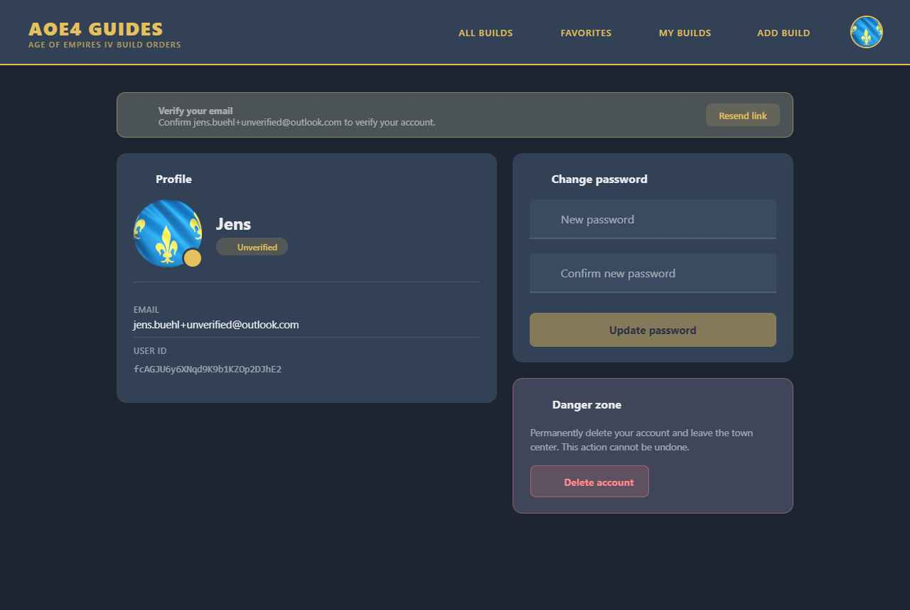
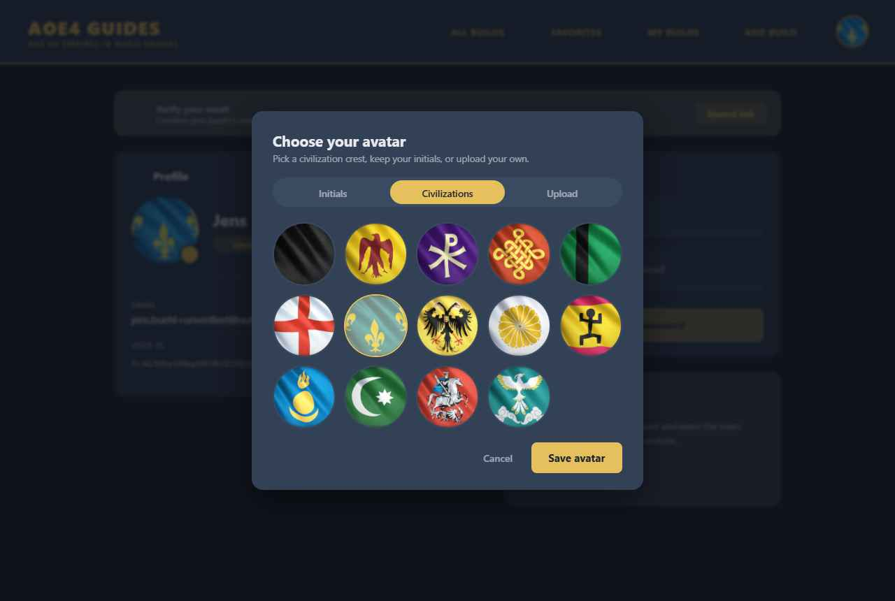

# Feature Specification: Account Page Redesign & User Avatars

**Feature Branch**: `002-account-redesign`

**Created**: 2026-06-02

**Status**: Draft — spec only (plan & tasks to be generated later via `/speckit-plan` and `/speckit-tasks`)

**Input**: Redesign the account/profile management page and introduce user-selectable **avatars**. Today the page is four near-identical stacked cards in a narrow column; read-only identity values are rendered as (misleading) editable text fields; there is no avatar, password change has a single unconfirmed field, and the destructive "Delete Account" looks identical to benign actions. This feature reworks the layout for clarity and adds an avatar the user can set from a **curated set of Age of Empires IV civilization crests**, their **initials** (default), or an **uploaded image**. (Display name remains read-only for now — see FR-007.)

> **Design reference**: interactive prototype at `Account Redesign.html` (project root; open the avatar to see the picker). Stills bundled in `assets/`. Built on the existing AOE4 Vuetify theme tokens (`reference/design-tokens.md`). The civilization-crest images already ship in the repo at `src/assets/pictures_original_size/civilization_flag/`.

## Clarifications

### Session 2026-06-02

- Q: Should custom image upload be included in v1 or deferred? → A: **In scope for v1.** All three avatar sources (initials, civ crests, custom upload) ship together.
- Q: Where should avatars render — account page + header only, or also build cards, comments, and discussions? → A: **Account page + header only for this feature.** Build cards and comment/discussion threads currently denormalize `author` (display name) into each document to avoid extra reads; adding `authorPhotoURL` the same way creates a staleness problem. The recommended future path is a client-side profile cache in Vuex (look up `users/{uid}` lazily on first encounter, reuse for the session) — that work is explicitly out of scope here.

## User Scenarios & Testing *(mandatory)*

### User Story 1 - Choose an avatar (Priority: P1) 🎯 MVP

A logged-in user opens their account page and wants a recognizable avatar instead of a generic placeholder. They click their current avatar, and a picker opens offering three sources: **Initials** (generated from their display name, the default), **Civilizations** (a grid of AOE4 civ crests), and **Upload** (their own image). They pick a civ crest, save, and the avatar updates immediately in the profile and the header.

**Why this priority**: This is the headline new capability and the most-requested kind of personalization. Curated crests are zero-cost, on-brand, and need no moderation, so this story is independently shippable as the MVP.

**Independent Test**: From the account page, open the picker, select a civilization crest, save → the avatar updates in the profile hero and header without a page reload, and persists across reloads.

**Acceptance Scenarios**:

1. **Given** a user with no custom avatar, **When** the account page loads, **Then** an initials avatar (derived from display name) is shown by default.
2. **Given** the picker is open on the Civilizations tab, **When** the user selects a crest and saves, **Then** the avatar updates everywhere it appears and the choice is persisted to their profile.
3. **Given** the picker is open, **When** the user selects the Initials option and saves, **Then** any previously stored avatar reference is cleared and the initials avatar is shown.
4. **Given** the user opens the picker, **When** they cancel or dismiss it, **Then** no change is saved.

---

### User Story 2 - Clear, modern account layout (Priority: P1)

A user visits their account page to review their identity and manage settings. Instead of four identical floating cards, they see a **profile hero** (avatar + display name + verification status), their identity as **read-only labelled rows** (not fake input fields), and clearly grouped sections for security and account actions — using the page width sensibly and collapsing to one column on mobile. The display name is shown but is **read-only for now** (see FR-007).

**Why this priority**: The current layout actively misleads (read-only data styled as editable inputs) and wastes space. The redesign is the container the avatar and other stories live in.

**Independent Test**: Load the account page on desktop → identity values render as static rows (Email, User ID), User ID has a copy affordance, sections are grouped, and the layout is two-column. On a narrow viewport it collapses to a single column with ≥44px touch targets.

**Acceptance Scenarios**:

1. **Given** the account page, **When** it renders, **Then** Email and User ID are shown as read-only rows clearly distinct from editable inputs.
2. **Given** the User ID row, **When** the user clicks the copy control, **Then** the User ID is copied to the clipboard and a confirmation is shown.
3. **Given** a viewport below the mobile breakpoint, **When** the page renders, **Then** sections stack in a single column and remain usable.

---

### User Story 3 - Change password with confirmation (Priority: P2)

A user changes their password and is protected from typos by a confirmation field and a visibility toggle.

**Why this priority**: The current single, unconfirmed password field is error-prone. Low effort, clear safety win.

**Independent Test**: Enter a new password and a non-matching confirmation → submit is blocked with a mismatch message. Match them → submit succeeds via the existing change-password flow.

**Acceptance Scenarios**:

1. **Given** the change-password section, **When** the new password and confirmation differ, **Then** submit is disabled and a mismatch message is shown.
2. **Given** matching passwords, **When** the user submits, **Then** the password is changed via the existing flow and a success confirmation is shown.
3. **Given** a password field, **When** the user toggles visibility, **Then** the entered value is shown/hidden.

---

### User Story 4 - Safe account deletion (Priority: P3)

A user who wants to delete their account finds the action clearly separated in a visually distinct "Danger zone" and must confirm in a dialog before anything is destroyed.

**Why this priority**: Today delete looks identical to benign actions. De-risking destructive actions is important but not blocking.

**Independent Test**: The delete control is visually distinct (danger styling), separated from other actions; activating it opens a confirmation dialog; only confirming triggers the existing delete flow.

**Acceptance Scenarios**:

1. **Given** the account page, **When** it renders, **Then** account deletion is in a visually distinct danger section, not styled like the benign buttons.
2. **Given** the delete control, **When** activated, **Then** a confirmation dialog explains the consequences and requires explicit confirmation.
3. **Given** the confirmation dialog, **When** the user confirms, **Then** the existing delete-account flow runs; when they cancel, nothing happens.

---

### User Story 5 - Email verification banner (Priority: P3)

An unverified user sees a concise inline banner prompting them to confirm their email, with a resend action. The banner disappears once verified.

**Why this priority**: Replaces the permanent verification *card* with a contextual banner, and **corrects the copy** — the previous text promised "build order notifications," a feature that does not exist yet.

**Independent Test**: An unverified account shows the banner with neutral, accurate copy and a working resend control; a verified account does not show the banner.

**Acceptance Scenarios**:

1. **Given** an unverified user, **When** the account page loads, **Then** a banner prompts them to confirm their email using **neutral copy that does not reference notifications or any unbuilt feature**.
2. **Given** the banner, **When** the user clicks resend, **Then** the existing verification-email flow runs and a confirmation is shown.
3. **Given** a verified user, **When** the page loads, **Then** no verification banner is shown.

---

### Edge Cases

- **No display name** → initials avatar falls back gracefully (e.g. a neutral placeholder), never blank.
- **Uploaded image is huge / wrong type** (if upload ships) → it is resized/validated before storage; oversized or non-image files are rejected with a message.
- **Avatar fails to load** (broken/missing image) → falls back to initials rather than a broken-image icon.
- **Crest set changes** (a civ is renamed/removed) → stored crest codes that no longer resolve fall back to initials.
- **Reduced motion** → dialog/transition entrances respect `prefers-reduced-motion`.
- **Slow network on save** → controls show progress and prevent duplicate submits.

## Requirements *(mandatory)*

### Functional Requirements

- **FR-001**: Users MUST be able to set an avatar from at least two sources — generated **initials** (default) and a **curated set of AOE4 civilization crests** — via a picker opened from their current avatar.
- **FR-002**: The system MUST persist the avatar **choice** to the user's profile and reflect it immediately in the **profile hero and the app header** without a full reload. Rendering the avatar on build cards, comments, and discussions is **explicitly out of scope** until the author-denormalization problem is solved separately.
- **FR-003**: For curated crests, the system MUST store only a lightweight **reference** (e.g. the civilization code), resolving it to a bundled asset — no per-user image file is stored.
- **FR-004**: The initials avatar MUST be derived from the user's display name.
- **FR-005**: *(If custom upload is in scope)* Uploaded images MUST be **resized/cropped to a small square (target ≤256px, WebP) before upload**, so stored/transferred size stays minimal; a maximum stored size MUST be enforced server-side as a backstop.
- **FR-006**: The account page MUST present read-only identity values (Email, User ID) as clearly non-editable rows, and MUST provide a copy action for the User ID.
- **FR-007**: The display name MUST be shown read-only on the account page; editing it is **out of scope for now**. (Rationale: the display name is denormalized into every build-order document to reduce reads; allowing edits would require rewriting all of a user's builds. Deferred until a safe update path exists.)
- **FR-008**: The change-password section MUST require a confirmation field, block submission on mismatch, and offer a visibility toggle; it MUST use the existing change-password flow.
- **FR-009**: Account deletion MUST be visually separated as a danger action and MUST require explicit confirmation in a dialog before invoking the existing delete flow.
- **FR-010**: The email-verification prompt MUST be a contextual banner shown only to unverified users, with **accurate copy that makes no claim about notifications or other unbuilt features**, and a resend action using the existing flow.
- **FR-011**: The layout MUST be responsive — multi-column on desktop, single-column on mobile — and use existing theme tokens for light and dark themes.
- **FR-012**: Avatars MUST gracefully fall back to initials whenever an image reference is missing, broken, or unresolved.

### Key Entities

- **Avatar reference** (on the user profile): a small value describing the chosen avatar — its **type** (`initials` | `civ` | `upload`) and, for `civ`, the civilization code, or for `upload`, the stored image location. No new collection; this extends the existing user profile/identity record. Curated and initials choices add **no binary storage**.
- *(If upload ships)* **Avatar image**: a single small per-user file (square, ≤256px, WebP) in object storage keyed by user id; replacing it overwrites the previous file. Subject to a server-side size/type rule.

## Success Criteria *(mandatory)*

### Measurable Outcomes

- **SC-001**: A user can set a civilization-crest avatar in under 15 seconds from opening the account page, with the change visible immediately and after reload.
- **SC-002**: Curated-crest and initials avatars add **zero per-user image storage** and **zero new moderation surface**.
- **SC-003**: *(If upload ships)* Stored avatar images are ≤ ~30KB each after client-side resize, keeping storage and bandwidth within free-tier limits.
- **SC-004**: 0 read-only identity fields are rendered as editable-looking inputs (no user confusion about what is editable).
- **SC-005**: The verification prompt contains no claim about features that do not yet exist.
- **SC-006**: The page is fully usable in one column at mobile widths with touch targets ≥44px, in both light and dark themes.

## Assumptions

- Built entirely with **Vuetify** components and the existing theme tokens (Constitution III); no new UI dependency.
- Reuses existing flows for change password, email verification, and account deletion — this feature is primarily **UI/UX plus avatar persistence**, not new auth logic.
- **Display name is intentionally read-only for now.** It is denormalized into each build-order document (to reduce reads), so changing it would require updating all of a user's builds; a safe bulk-update path is a separate future feature.
- Curated crests reuse the civilization-crest images already in the repo; no new assets needed for the curated path.
- **Custom upload (if in scope)** introduces object storage and a moderation/abuse consideration (users could upload inappropriate images). Mitigations: client-side resize + server-side size/type rule + a way to report/replace. This is why curated-first is recommended (Constitution I & IV — simplicity, cost-conscious, free-tier first).
- Avatar reach beyond the account/header (build cards, comments) is out of scope until clarified.

## Design Reference

The approved visual direction (AOE4 dark/light theme, profile hero, sectioned layout, danger zone, and the three-source avatar picker):

**Account page (dark, unverified state)**

**Avatar picker — Civilizations tab (real AOE4 crests)**

Interactive prototype: `Account Redesign.html` in the project root — open the avatar to use the picker (Upload tab performs a real client-side resize-to-256px-WebP to demonstrate the cost-saving step). Tweaks panel toggles theme, verified state, and default avatar source.
