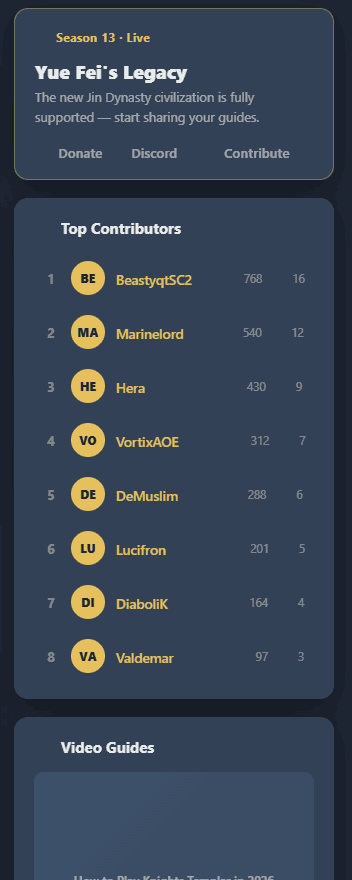
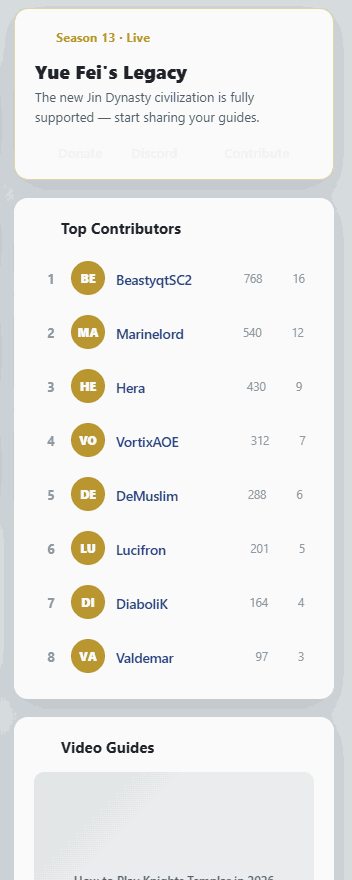

# Feature Specification: Home Sidebar Rework

**Feature Branch**: `004-home-sidebar`

**Created**: 2026-06-03

**Status**: Draft

**Input**: First of four scoped Home-page features (see `Home Redesign.html`). Rework the Home **sidebar** only: tidy the overloaded News/Season card down to a focused card with low-key support links, restyle **Top Contributors** into one clean ranked card that renders **all** contributors the data provides (not a hard-capped 4), and keep **Video Guides**. Logged-out / unverified prompts (`RegisterAd`, `EmailVerificationAd`) remain. Presentation only — no data, schema, or read/write changes.

> **Scope guard:** this feature changes only the right-hand sidebar of `Home.vue` and the `News.vue` component. It does **not** touch the civilization picker, the build lists/lanes, or `BuildListCard` — those are separate features (005/006/007).

> **Design reference:** `Home Redesign.html` (project root) + `assets/sidebar-dark.png`, `assets/sidebar-light.png`. Built on existing theme tokens (`reference/design-tokens.md`). Real links already live in `News.vue` (Ko-fi donate, Discord invite, `/github` contribute).

## Clarifications

### Session 2026-06-03

- Q: Should the beta note (Jin Dynasty support warning) be removed from the redesigned Season card or kept in reduced form? → A: Drop it entirely from the Season card.
- Q: Should the season banner image (`/Season11-banner.webp`) be kept in the redesigned card? → A: Remove it — it is dead code (Season 11 image on Season 13).
- Q: Should the season status tag ("Season 13 · Live") and one-line blurb be hardcoded in the template or sourced from the wireframe/design file? → A: Hardcoded static text — implementer writes copy directly in the template, consistent with current News.vue approach.
- Q: Should the desktop sidebar use `position: sticky` or scroll with the page? → A: Scroll with the page — no sticky behaviour for now.
- Q: Should the redesigned Season card use a `v-alert` wrapper (accent border) or a plain `v-card`? → A: Plain `v-card border rounded="lg"` — the design prototype shows a consistent subtle border on all sidebar cards (Season, Top Contributors, Video Guides); the `v-alert` accent wrapper is removed.

## User Scenarios & Testing *(mandatory)*

### User Story 1 - A focused Season/News card (Priority: P1) 🎯 MVP

A visitor glances at the sidebar to see what's current. Instead of a dense card stacked with a banner, three store buttons, a beta alert, an embedded video, and two appeal paragraphs, they see a compact card: a "Season 13 · Live" tag, the season title, one short line, and a quiet row of support links (Donate · Discord · Contribute).

**Why this priority**: The current News card is the densest, most CTA-heavy element on the page. Calming it is the core of this feature and is independently shippable.

**Independent Test**: Load Home → the News/Season card shows the season tag, title, a one-line blurb, and a single low-emphasis row of Donate / Discord / Contribute links; the previous store-button cluster, embedded video, and long paragraphs are gone from this card.

**Acceptance Scenarios**:

1. **Given** Home, **When** the sidebar renders, **Then** the News/Season card shows: a season status tag, the season title, a concise one-line description, and a quiet actions row.
2. **Given** the actions row, **When** rendered, **Then** it contains **Donate** (Ko-fi), **Discord**, and **Contribute** (`/github`) as low-emphasis text links — not filled/prominent buttons — reusing the existing hrefs/routes from `News.vue`.
3. **Given** the Donate link, **When** clicked, **Then** it opens the existing Ko-fi destination; Discord opens the existing invite; Contribute goes to the existing `/github` route.
4. **Given** the card, **When** compared to today, **Then** the store buttons (Steam/MS/Xbox), the embedded YouTube iframe, the beta alert, and the two appeal paragraphs are removed from this card (video lives in the separate Video Guides card; beta status may be conveyed by a single short word if desired).

---

### User Story 2 - Top Contributors renders all provided, not capped at 4 (Priority: P1)

A visitor scans the community leaderboard. Top Contributors is one tidy card of ranked rows — avatar (or initials), name, and view/build counts — and shows **every** contributor the home snapshot provides (e.g. 8), not an arbitrary four.

**Why this priority**: The number of contributors shown should follow the data, and the rows should read as one cohesive list. Core ask from review.

**Independent Test**: With a snapshot containing N contributors (verify with N = 8), the Top Contributors card renders all N as ranked rows with no UI-side cap and no layout break; clicking a row opens that contributor's builds.

**Acceptance Scenarios**:

1. **Given** a `topContributorsList` of length N, **When** the card renders, **Then** it shows all N rows (verify N = 8) with rank, avatar/initials, name, and view & build counts.
2. **Given** a contributor row, **When** clicked, **Then** it navigates to that contributor's builds (existing `Builds` route with `author` query).
3. **Given** a contributor without an avatar image, **When** rendered, **Then** a 2-letter initials avatar is shown (existing fallback).
4. **Given** the card, **When** rendered in dark and light, **Then** contributor names use the theme primary color (gold on dark, navy on light), consistent with the rest of Home.

---

### User Story 3 - Video Guides + conditional prompts retained (Priority: P3)

A visitor still sees the Video Guides card, and logged-out or unverified users still see the register / verify-email prompts in the sidebar.

**Why this priority**: These already work; the rework must not drop them. Low risk, but explicitly in scope so nothing regresses.

**Independent Test**: Video Guides renders as its own card; a logged-out user sees `RegisterAd`; an unverified user sees `EmailVerificationAd`; a verified user sees neither.

**Acceptance Scenarios**:

1. **Given** the sidebar, **When** rendered, **Then** a Video Guides card appears as its own card (the embedded video is no longer inside the News card).
2. **Given** a logged-out visitor, **When** the sidebar renders, **Then** `RegisterAd` is shown.
3. **Given** an unverified signed-in user, **When** the sidebar renders, **Then** `EmailVerificationAd` is shown.

---

### Edge Cases

- **Zero contributors** → the card hides or shows a short empty state, never a broken/blank list.
- **Long contributor name / large counts** → name truncates with ellipsis; counts stay right-aligned.
- **Very tall sidebar (8+ contributors)** → on desktop the sidebar may exceed viewport height; the sidebar scrolls with the page (no sticky), so all cards remain reachable.
- **Mobile** → the sidebar stacks below the main column; cards remain full-width and legible.

## Requirements *(mandatory)*

- **FR-001**: The News/Season card MUST be reduced to a season status tag, the season title, a concise one-line description, and a single low-emphasis actions row.
- **FR-002**: The actions row MUST present **Donate**, **Discord**, and **Contribute** as low-emphasis text links (icon + label), reusing the existing destinations from `News.vue` (Ko-fi, Discord invite, `/github`). The Donate icon MUST keep its red heart accent.
- **FR-003**: The store-button cluster, embedded video iframe, the beta alert, the season banner image, and the long appeal paragraphs MUST be removed from the News card (video belongs to Video Guides; support messaging is conveyed by the quiet links; the beta note and stale Season 11 banner are dropped entirely).
- **FR-004**: Top Contributors MUST render **all** contributors from `topContributorsList` with **no UI-side cap**, as ranked rows (rank, avatar/initials, name, view & build counts), and MUST remain visually intact at 8+ rows.
- **FR-005**: A contributor row MUST navigate to that contributor's builds via the existing route/query; a missing avatar MUST fall back to initials.
- **FR-006**: Contributor names (and any card titles) MUST use the theme primary color (gold dark / navy light).
- **FR-007**: The Video Guides card MUST remain as its own card; `RegisterAd` and `EmailVerificationAd` MUST remain under their existing conditions.
- **FR-008**: All sidebar cards MUST use `v-card border rounded="lg"` for a consistent subtle border and MUST follow the shared spacing system (see plan.md) for consistent padding and inter-card gutter; MUST render correctly in light and dark themes. The `v-alert` wrapper currently on `News.vue` MUST be removed.
- **FR-009**: This feature MUST NOT change data sourcing (the single hourly home snapshot) nor any other Home region.
- **FR-010**: The **Welcome card** (`Welcome, Villager! / Welcome, {displayName}!`) MUST be removed from the sidebar. The new design starts directly with the Season card.

### Key Entities

- *No new entities.* Season copy is static; contributor rows come from the existing `topContributorsList` in the home snapshot.

## Success Criteria *(mandatory)*

- **SC-001**: The News/Season card surfaces at most one short paragraph plus a single quiet actions row (no store buttons, no embedded video, no multi-paragraph appeals).
- **SC-002**: Top Contributors shows exactly the number of contributors in the data (verified at 8) with no truncation or layout break.
- **SC-003**: Donate / Discord / Contribute reach the same destinations as today.
- **SC-004**: Sidebar reads correctly in light and dark themes; contributor names follow the theme primary color.
- **SC-005**: No diffs outside the sidebar region of `Home.vue` and `News.vue` (plus any small extracted sidebar component).
- **SC-006**: The Welcome card is absent from the rendered sidebar in both logged-out and logged-in states.

## Assumptions

- Built with Vuetify + existing theme tokens; no new dependency. Cards = `v-card border rounded="lg"` (consistent subtle border on all three sidebar cards, matching the design prototype); links = `v-btn variant="text"` (already how `News.vue` renders Donate/Discord/Contribute); contributor rows reuse the existing avatar/chip pattern.
- Season status tag ("Season 13 · Live") and the one-line blurb are hardcoded static strings in the template, consistent with the existing `News.vue` approach. The stale Season 11 banner image is removed.
- The home snapshot already provides the contributor list; increasing how many it returns (if desired) is a Cloud Function/data change and is **out of scope** here — this feature just stops capping on the UI side and lays out whatever is provided.
- The beta note currently in `News.vue` is dropped entirely; full beta messaging, if still wanted, belongs on the build editor where it is contextual.

## Design Reference

**Sidebar — dark** (Season card with quiet Donate/Discord/Contribute; 8 contributors; Video Guides)

**Sidebar — light** (names in navy primary)

Interactive: `Home Redesign.html` — the sidebar is the right-hand rail; Tweaks toggle theme.
