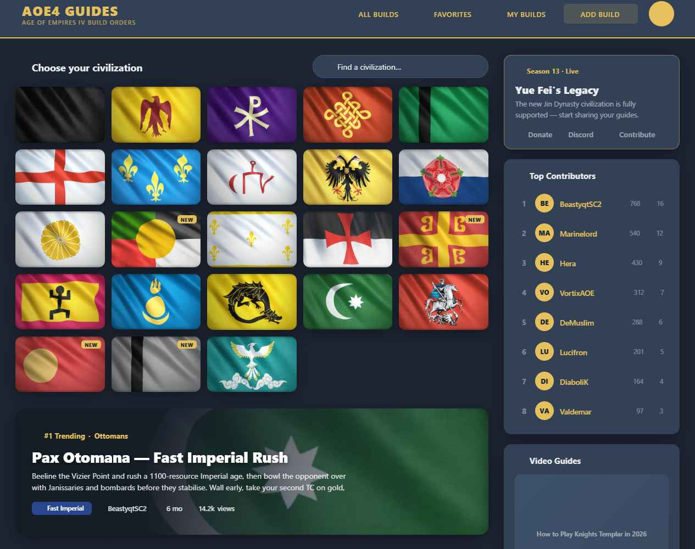
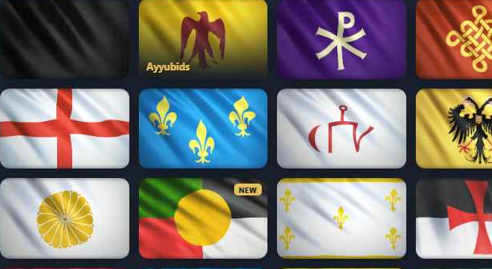
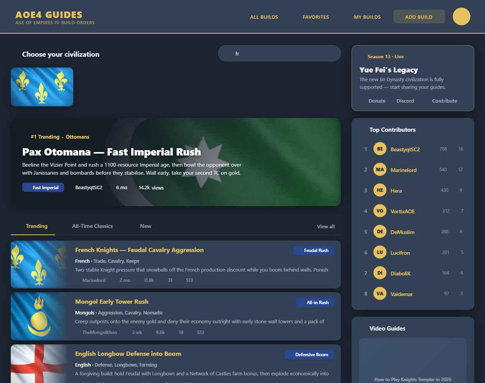

# Feature Specification: Home Civilization Picker (dense grid + tooltip + search)

**Feature Branch**: `005-home-civ-picker`

**Created**: 2026-06-04

**Status**: Draft

**Input**: Second of four scoped Home-page features. Replace the tall two-column civilization **list** with a **dense flag-tile grid**: uniform 16:10 tiles, name revealed on hover/focus (with tooltip), a search field on the header row to filter by name or tagline, and an empty state. Keeps the existing "NEW" recent-build marker and the existing navigation target. Presentation only — no data, schema, or read/write changes.

> **Scope guard:** changes only the civilization-picker region of `Home.vue` (and any small extracted picker component). Does **not** touch the sidebar (004), the build lanes/tabs (006), the hero (007), or `BuildListCard`.

> **Design reference:** `Home Redesign.html` (project root) + `assets/`. **Exact styling in `css-reference.md`** (resolved tokens, full CSS, a11y, Vuetify mapping). Built on existing theme tokens (`reference/design-tokens.md`); flags are the existing `*.webp` banners.

## User Scenarios & Testing *(mandatory)*

### User Story 1 - Dense civilization grid (Priority: P1) 🎯 MVP

A visitor lands on Home and sees every civilization at once as a compact grid of flag tiles — roughly a third of the height of today's list — so build content is reachable with far less scrolling.

**Why this priority**: The civ picker is the primary entry action and the biggest space hog today. Compacting it is the core win and is independently shippable.

**Independent Test**: Load Home → all civs render as a responsive flag-tile grid (5 cols desktop, 4 at ≤1080px, 3 at ≤720px); tiles are uniform 16:10; clicking a tile navigates to that civ's builds via the existing route/query.

**Acceptance Scenarios**:

1. **Given** Home, **When** it renders, **Then** all civilizations appear as a uniform flag-tile grid materially shorter than the current 2-column list.
2. **Given** a tile, **When** clicked (or activated by keyboard), **Then** the visitor goes to that civ's builds using the **existing** route/query — no data-model change.
3. **Given** the grid at desktop / ≤1080px / ≤720px, **When** rendered, **Then** it shows 5 / 4 / 3 columns respectively without overflow.

---

### User Story 2 - Name on hover + tooltip (Priority: P1)

To keep tiles dense, the civ name is not printed on every tile; instead it reveals on hover and on keyboard focus, and a tooltip shows the name on mouse hover. The name is always available to assistive tech.

**Why this priority**: Density depends on removing always-on labels, but identity must never be lost — especially for keyboard, screen-reader, and touch users.

**Independent Test**: Hovering a tile reveals its name overlay and a tooltip; tabbing to a tile shows a focus ring **and** the name overlay; a screen reader announces the civ name without hover (via `aria-label`/`alt`).

**Acceptance Scenarios**:

1. **Given** a tile, **When** hovered, **Then** its name fades in over a legibility gradient and a `title` tooltip appears.
2. **Given** keyboard navigation, **When** a tile receives focus, **Then** a visible focus ring shows and the name overlay reveals.
3. **Given** assistive tech, **When** a tile is reached, **Then** the civ name is announced (accessible name present regardless of hover).
4. **Given** either theme, **When** the name shows, **Then** it uses the theme primary color (gold dark / navy light) and meets ≥4.5:1 contrast over the gradient.

---

### User Story 3 - Search filter + NEW marker + empty state (Priority: P2)

A visitor types in the header search to narrow the grid by civilization name **or tagline**; non-matches disappear live; a friendly empty state shows when nothing matches. Civs with a recent build keep a "NEW" marker.

**Why this priority**: With names hidden on tiles, search is the primary find-by-name path and the touch-friendly fallback. NEW + empty state round out the behavior.

**Independent Test**: Typing "fr" filters to French (matches name) and any civ whose tagline contains the query; clearing restores all; a no-match query shows the empty state; a recent-build civ shows the NEW marker.

**Acceptance Scenarios**:

1. **Given** the search field, **When** the visitor types, **Then** the grid filters live to civs matching the query in **name or tagline** (case-insensitive).
2. **Given** a non-empty query, **When** a clear control is shown and activated, **Then** the query resets and all civs return.
3. **Given** a query with no matches, **When** filtering, **Then** a one-line empty state is shown (no broken/blank grid).
4. **Given** a civ with a recent build, **When** the grid renders, **Then** a NEW marker is shown (existing `isNew` logic).

---

### Edge Cases

- **Touch (no hover)** → civ names are always visible on tiles at ≤720px (no hover available); tooltip/`aria-label` + search remain available.
- **Very long civ name** → name overlay wraps/truncates without breaking the tile.
- **Search matches everything / nothing** → grid restores fully / shows empty state.
- **Keyboard-only** → all tiles reachable and operable; focus ring always visible.
- **Reduced motion** → hover lift / reveal respect `prefers-reduced-motion`.
- **Loading state** → skeleton tiles in the grid layout are shown until the civ list is available; no flash of empty content.

## Requirements *(mandatory)*

- **FR-001**: The picker MUST render all civilizations as a responsive flag-tile grid (5/4/3 columns at desktop/≤1080/≤720px), tiles uniform at 16:10, materially shorter than the current list.
- **FR-002**: A tile MUST navigate to that civ's builds via the existing route/query, operable by mouse and keyboard.
- **FR-003**: The civ name MUST be hidden on the tile by default and revealed on hover **and** on keyboard focus, with a `title` tooltip on hover. At ≤720px, the civ name MUST always be visible (no hover available on touch).
- **FR-004**: Every tile MUST expose its civ name to assistive tech at all times (e.g. `aria-label` on the control and meaningful `alt` on the flag), independent of hover.
- **FR-005**: The civ name MUST use the theme primary color (gold dark / navy light) over a legibility gradient meeting ≥4.5:1 contrast in both themes.
- **FR-006**: A header search field MUST filter the grid live by civilization **name or tagline** (case-insensitive), with an accessible label and a clear control.
- **FR-007**: A no-match query MUST show a concise empty state; clearing the query MUST restore the full grid.
- **FR-008**: Civilizations with a recent build MUST keep the existing "NEW" marker.
- **FR-009**: Keyboard focus MUST be clearly visible (focus ring); interactive targets MUST meet hit-area minimums (search clear ≥44px tap area on touch).
- **FR-010**: The feature MUST render correctly in light and dark themes and MUST NOT change data sourcing (existing civ provider / home snapshot) or any other Home region.
- **FR-011**: While the civilization list is loading, the picker MUST display skeleton/ghost tiles in the same grid layout (matching the column count at the current breakpoint).

### Key Entities

- *No new entities.* Civilization list (code, name, tagline, isNew flag, flag image) comes from the existing provider.

## Success Criteria *(mandatory)*

- **SC-001**: The picker occupies ~⅓ of its current vertical height on desktop (≈6 rows vs ≈14).
- **SC-002**: Every civ is identifiable without hover via tooltip/search and assistive-tech name.
- **SC-003**: Search narrows by name and tagline; empty state appears on no match; clear restores all.
- **SC-004**: Keyboard users can reach, identify (focus reveals name), and activate every tile.
- **SC-005**: Picker reads correctly in light and dark; name color follows theme primary.
- **SC-006**: No diffs outside the civ-picker region of `Home.vue` (plus any extracted picker component).

## Assumptions

- Built with Vuetify + existing theme tokens; no new dependency. See `css-reference.md` §6 for the Vuetify mapping (`v-text-field clearable` for search, `v-card`+`v-img` tiles, CSS grid wrapper, `v-chip` NEW badge). Hover-reveal overlay + focus ring are the only genuinely custom CSS.
- Flags are the existing wide `*.webp` banners; tiles use `object-fit: cover` at 16:10.
- "Recent build" (NEW) reuses the existing `isNew` logic; "tagline" is the existing civ subtitle/description string already shown in today's list rows.
- Navigation target is unchanged from today's list rows.

## Design Reference

**Dense grid — dark** (5 columns, uniform tiles, NEW markers)

**Hover / focus reveal** (name in theme primary over legibility gradient)

**Search filter** (typing "fr" narrows the grid live)

Exact styling: **`css-reference.md`**. Interactive: `Home Redesign.html` / `../_home-wireframe/home-wireframe.html` (Tweaks → civ-picker style toggles dense grid vs. legacy list).

## Clarifications

### Session 2026-06-04

- Q: Should civ names be always visible on touch/small screens (≤720px) or hidden unless tapped/searched? → A: Always visible at ≤720px (Option A).
- Q: What should the picker show while the civilization list is loading? → A: Skeleton/ghost tiles in the same grid layout (Option A).
