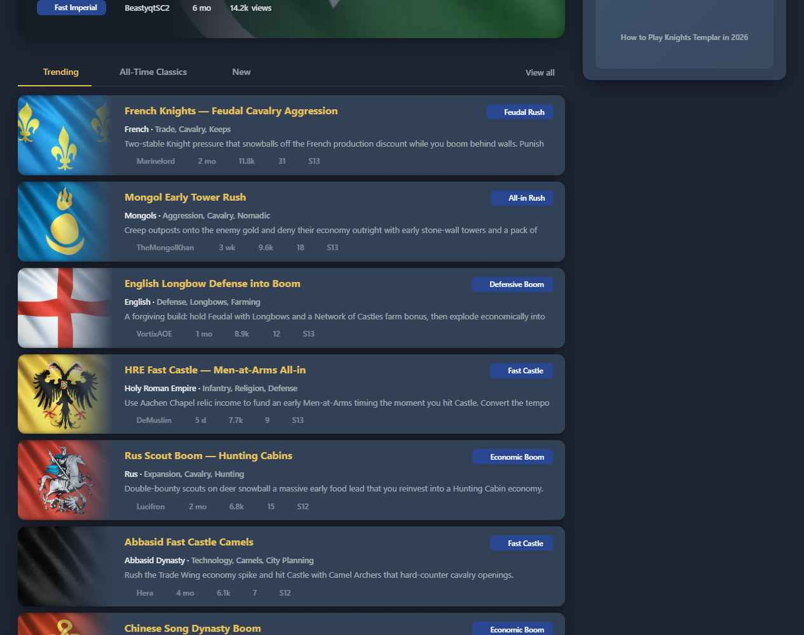
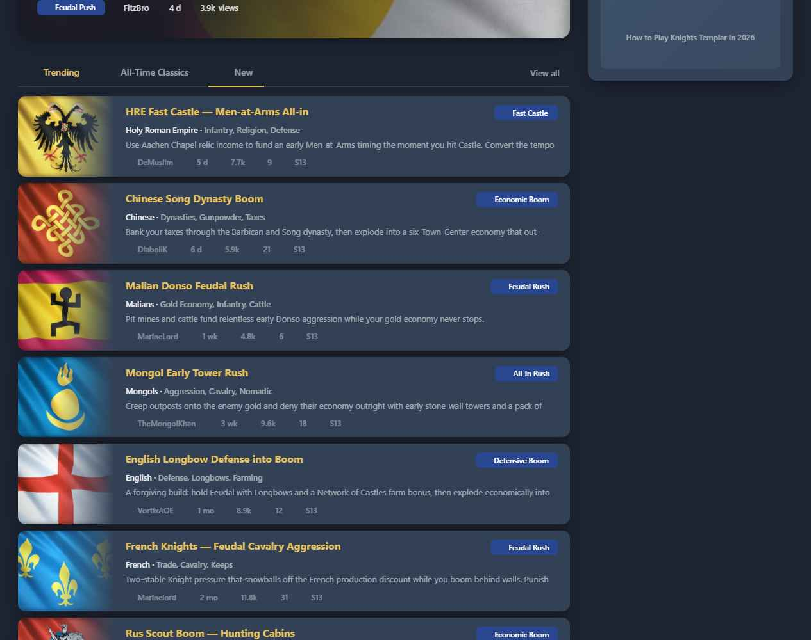

# Feature Specification: Home Build Lane Tabs

**Feature Branch**: `006-home-build-tabs`

**Created**: 2026-06-04

**Status**: Draft

**Input**: Third of four scoped Home-page features. Replace the three **stacked** build lists (Trending, All-Time Classics, New) with a **tabbed** section: one tab bar, one lane visible at a time, switchable in place, with a contextual **View all** that targets the existing Builds list pre-sorted for the active lane. Reuses the existing `BuildListCard` unchanged and the already-loaded home snapshot. Presentation only — no data, schema, or read/write changes.

> **Scope guard:** changes only the build-list **section** of `Home.vue` (the lane structure). It does **not** touch the sidebar (004), the civ picker (005), the hero (007), or **`BuildListCard`** (the card itself is reused as-is).

> **Design reference:** `Home Redesign.html` (project root) + `assets/`. **Exact styling in `css-reference.md`** (resolved tokens, full CSS, behavior contract, Vuetify mapping, View-all→orderBy table). Built on existing theme tokens (`reference/design-tokens.md`).

## User Scenarios & Testing *(mandatory)*

### User Story 1 - One tabbed section instead of three stacked lists (Priority: P1) 🎯 MVP

A visitor reaches the build section and sees a tab bar — **Trending · All-Time Classics · New** — with one lane's list shown. Switching tabs swaps the list in place. The section is about a third of today's height and no longer repeats the same builds across three lists.

**Why this priority**: The stacked lists repeat builds and trail far down the page. Tabs compress the section and remove the visible repetition — the core win, independently shippable.

**Independent Test**: On Home, the build section renders a tab bar with three lanes, Trending active by default and its list shown; selecting another tab swaps the visible list **without a page navigation or refetch**.

**Acceptance Scenarios**:

1. **Given** Home, **When** the build section renders, **Then** a tab bar shows Trending / All-Time Classics / New with **Trending active** and its list visible.
2. **Given** the tab bar, **When** the visitor selects another lane, **Then** the visible list swaps to that lane in place (no route change, no new fetch).
3. **Given** the active lane, **When** rendered, **Then** it reuses the **existing `BuildListCard`** for each item (card unchanged).
4. **Given** the three lanes, **When** compared to today, **Then** the same build no longer appears simultaneously in multiple visible lists.

---

### User Story 2 - Contextual "View all" (Priority: P1)

Each lane offers a **View all** action that takes the visitor to the full Builds list, pre-sorted to match the active lane — exactly what today's per-section arrows do.

**Why this priority**: Tabs show a top slice; users need the full list per lane. Reusing the existing sort keeps it zero-risk.

**Independent Test**: With a lane active, activating **View all** navigates to the Builds route with the lane's `orderBy` (`score` / `scoreAllTime` / `timeCreated`).

**Acceptance Scenarios**:

1. **Given** the Trending lane, **When** View all is activated, **Then** it navigates to Builds with `orderBy=score`.
2. **Given** the All-Time Classics lane, **When** View all is activated, **Then** `orderBy=scoreAllTime`.
3. **Given** the New lane, **When** View all is activated, **Then** `orderBy=timeCreated`.
4. **Given** View all, **When** rendered, **Then** it is a link (navigates) and is visually distinct from the in-place tabs.

---

### User Story 3 - Keyboard & assistive-tech support (Priority: P2)

A keyboard or screen-reader user can move between lanes with arrow keys, knows which lane is selected, and reaches the lane's list and View all.

**Why this priority**: A tab pattern is only correct if it implements the tab interaction model; otherwise it regresses accessibility versus the plain stacked lists.

**Independent Test**: Tabs expose `tablist`/`tab`/`tabpanel` semantics with `aria-selected`; arrow keys move focus between tabs; the active tab has a visible focus ring; the panel is associated with its tab.

**Acceptance Scenarios**:

1. **Given** the tab bar, **When** a screen reader reaches it, **Then** it is announced as a tablist with the selected tab indicated.
2. **Given** keyboard focus on a tab, **When** arrow keys are pressed, **Then** focus moves between tabs (roving tabindex) and a visible focus ring shows.
3. **Given** a selected tab, **When** inspected, **Then** its panel (the list) is associated via `aria-controls`/`aria-labelledby`.
4. **Given** reduced-motion, **When** switching tabs, **Then** the underline slide / panel transition is suppressed.

---

### Edge Cases

- **Empty lane** → the active lane shows a concise empty state; the tab bar still renders.
- **Deep-linking** → out of scope; tab state is not persisted or reflected in the URL.
- **Navigation return** → the active tab resets to Trending every time Home is visited; no sessionStorage or URL state.
- **Narrow / mobile** → tab labels may shorten or the bar may scroll horizontally; tabs remain reachable; View all stays accessible (may wrap below).
- **Hero present (007)** → fully out of scope here; this feature renders the full lane list as-is. 007 will add exclusion of the #1 build when implemented.

## Requirements *(mandatory)*

- **FR-001**: The build section MUST present Trending / All-Time Classics / New as a tab bar with one lane visible at a time, Trending active by default. The active tab MUST reset to Trending on every visit (no persistence).
- **FR-002**: Selecting a tab MUST swap the visible list **in place** — no page navigation and no additional data fetch (lanes derive from the already-loaded home snapshot).
- **FR-003**: Each lane MUST reuse the **existing `BuildListCard`** unchanged for its items. This feature MUST NOT modify the card.
- **FR-004**: A contextual **View all** MUST navigate to the existing Builds list with the active lane's sort: Trending→`score`, Classics→`scoreAllTime`, New→`timeCreated` (same as today's section arrows).
- **FR-005**: View all MUST be a link (navigates) and visually distinct from the in-place tabs.
- **FR-006**: The tab bar MUST implement the tab interaction model: `tablist`/`tab`/`tabpanel` roles, `aria-selected`, panel association, roving arrow-key focus, and a visible focus ring.
- **FR-007**: The active tab MUST be indicated visually with the theme primary color (gold dark / navy light) for label and underline.
- **FR-008**: Tab/underline/panel transitions MUST respect `prefers-reduced-motion`.
- **FR-009**: An empty active lane MUST show a concise empty state without breaking the tab bar.
- **FR-010**: The feature MUST render correctly in light and dark themes and MUST NOT change data sourcing or any other Home region.

### Key Entities

- *No new entities.* The three lanes are sorted views over the existing home-snapshot builds (popular/all-time/recent).

## Success Criteria *(mandatory)*

- **SC-001**: The build section occupies ~⅓ of its current height (one lane vs. three stacked lists).
- **SC-002**: The same build no longer appears in multiple simultaneously-visible lists.
- **SC-003**: Switching tabs changes the visible list with no route change and no new network request.
- **SC-004**: View all lands on the same sorted Builds list as today's section arrows, per lane.
- **SC-005**: Keyboard users can move between tabs with arrow keys, see focus, and know the selection; screen readers announce the tablist and selection.
- **SC-006**: No diffs outside the build-list section of `Home.vue` (plus any extracted lane component); `BuildListCard` untouched.

## Assumptions

- Built with Vuetify + existing theme tokens; no new dependency. Recommended: `v-tabs` + `v-window` (native sliding indicator + tab a11y); View all as a `v-btn variant="text" :to>` in the tab row. See `css-reference.md` §5.
- The three sorted slices already exist in `Home.vue` today (they feed the current stacked lists); this feature re-presents them, it does not compute new ones.
- View all reuses the existing Builds route and `orderBy` values already wired to the current section arrows.
- The hero (007) is a separate feature; tabs are specified to work independently and compose with it.

## Design Reference

**Tabbed lanes — Trending active** (gold underline on active tab; existing/placeholder card reused below; View all at right)

**New active** (list swaps in place; underline moves; HRE 5d → Chinese 6d → Malian 1wk)

Exact styling: **`css-reference.md`**. Interactive: `Home Redesign.html` / `../_home-wireframe/home-wireframe.html` (Tweaks → Build lanes toggles tabs vs. stacked).

## Clarifications

### Session 2026-06-04

- Q: When a visitor navigates away and returns to Home, should the active tab reset to Trending or persist the last selection? → A: Reset to Trending on every visit (Option A — simple ref, no persistence).
- Q: Should this feature leave a forward-compatible hook (e.g., `excludeId` prop) for feature 007's hero exclusion? → A: No — fully self-contained; 007 adds exclusion when implemented (Option B).
