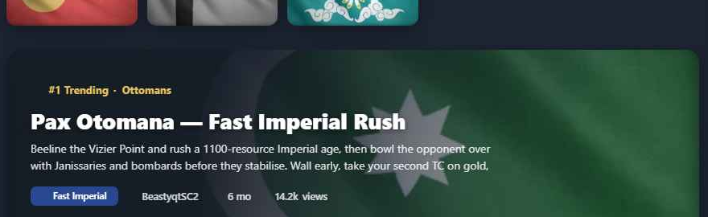
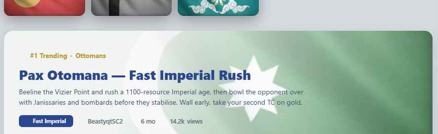

# Feature Specification: Home Featured "Hero" Build

**Feature Branch**: `007-home-hero`

**Created**: 2026-06-04

**Status**: Draft

**Input**: Fourth and final scoped Home-page feature. Add a **featured "hero" build** at the top of the build section: the active lane's #1 build presented with its civilization flag as a full-bleed, **theme-aware** diagonal fade (fades to near-black on dark, near-white on light), an eyebrow label, title, 2-line description, a strategy badge, and a real-fields-only meta row. The hero **swaps per tab** (composes with feature 006) and links to the build's detail. Presentation only — no data, schema, or read/write changes.

> **Scope guard:** adds the hero element to the top of the build section in `Home.vue` (and an optional component). It does **not** change the sidebar (004), civ picker (005), the tab mechanics themselves (006 — though it composes with them), or `BuildListCard`.

> **Design reference:** `Home Redesign.html` (project root) + `assets/`. **Exact styling in `css-reference.md`** — copy the scrim gradient and the `--hero-*` theme variables **verbatim**; the theme-aware fade is the defining detail and must not be approximated.

## User Scenarios & Testing *(mandatory)*

### User Story 1 - A featured hero with a theme-aware fade (Priority: P1) 🎯 MVP

A visitor sees one standout build at the top of the build section — the flag fills the card and fades diagonally into the page so the text is fully legible: **fades to dark with white text in dark mode, fades to white with navy text in light mode**. It gives the page a clear "start here."

**Why this priority**: The current page has flat hierarchy — every build looks equal. The hero creates a focal point. The theme-aware fade is the core, must-match detail.

**Independent Test**: On Home, the top build renders as a hero with its civ flag background and a diagonal fade; in dark mode the fade is near-black with a white title; in light mode it's near-white with a navy title; the title is fully legible in both.

**Acceptance Scenarios**:

1. **Given** Home in **dark** mode, **When** the hero renders, **Then** the flag fades into near-black (`rgba(20,26,37,…)`) on the text side and the title is white with a subtle shadow.
2. **Given** Home in **light** mode, **When** the hero renders, **Then** the flag fades into near-white (`rgba(250,250,250,…)`) on the text side and the title is navy (`#294790`) with no shadow.
3. **Given** either theme, **When** the hero renders, **Then** the eyebrow is gold accent, the strategy badge is franchise navy (`#294790`), and the title meets ≥4.5:1 contrast over the fade.
4. **Given** the hero, **When** it renders, **Then** the flag remains partly visible on the trailing (right) side via the gradient's low-alpha stop.

---

### User Story 2 - Hero swaps per active lane (Priority: P1)

The hero reflects the **active tab**: Trending shows the #1 trending build, All-Time Classics shows the #1 classic, New shows the latest. Switching tabs updates the hero and its eyebrow label.

**Why this priority**: Shipping the hero after tabs (006) means it's per-lane from day one — the behavior the team chose — instead of a Trending-only hero that needs rework later.

**Independent Test**: With tabs present, selecting each lane updates the hero to that lane's #1 build and the eyebrow text (`#1 Trending` / `#1 All-Time Classic` / `Latest Build`).

**Acceptance Scenarios**:

1. **Given** the Trending lane active, **When** the hero renders, **Then** it shows the top-by-`score` build with eyebrow "#1 Trending · <Civ>".
2. **Given** All-Time Classics active, **When** selected, **Then** the hero shows the top-by-`scoreAllTime` build with eyebrow "#1 All-Time Classic · <Civ>".
3. **Given** New active, **When** selected, **Then** the hero shows the most recent build with eyebrow "Latest Build · <Civ>".
4. **Given** the hero shows a build, **When** the lane list renders below, **Then** that build is **excluded** from the list (no duplicate first item).
5. **Given** an empty active lane, **When** rendered, **Then** the hero is hidden.

---

### User Story 3 - Hero is one accessible link with real fields only (Priority: P2)

Clicking anywhere on the hero opens that build's detail. The meta shows only fields that exist in the data model; the flag is decorative; keyboard users get a focus ring.

**Why this priority**: The hero must navigate correctly, must not imply data the app doesn't have, and must be operable/announced correctly.

**Independent Test**: Activating the hero (mouse or keyboard) routes to the build's detail; the meta row shows strategy/author/timeCreated/views only; tabbing to the hero shows a visible focus ring; a screen reader announces the title (flag has empty alt).

**Acceptance Scenarios**:

1. **Given** the hero, **When** clicked or activated by keyboard, **Then** it navigates to that build's detail (existing `BuildDetails` route).
2. **Given** the meta row, **When** rendered, **Then** it shows only **strategy, author, timeCreated, views** — no invented difficulty/rating.
3. **Given** keyboard focus on the hero, **When** focused, **Then** a visible focus ring is shown.
4. **Given** assistive tech, **When** the hero is reached, **Then** the build title is the accessible name and the flag image is not announced (empty/`aria-hidden`).

---

### Edge Cases

- **Tall description** → clamped to 2 lines via CSS (`-webkit-line-clamp: 2`); truncated with `…` so the hero keeps its height.
- **Missing description** → description slot hidden; hero renders title + meta only.
- **Loading state** → while the home snapshot hasn't arrived (`{ loading: true }` sentinel), the hero slot shows a skeleton/shimmer placeholder at hero dimensions to prevent layout shift.
- **Very dark/busy flag** → text stays legible because the fade is `.96` alpha on the text side; keep the stops.
- **No tabs feature present** → if shipped before 006, the hero defaults to the #1 trending build above the (then stacked) lists; it must still render.
- **Mobile** → title scales down (22px ≤720px); hero remains full-width and legible; flag still fades correctly.
- **Reduced motion** → the hero updates as an instant content swap (no CSS transition); reduced-motion requirement is trivially satisfied with no additional handling needed.

## Requirements *(mandatory)*

- **FR-001**: The build section MUST show a featured hero at its top: the active lane's #1 build with its civ flag as a full-bleed background and a diagonal fade overlay.
- **FR-002**: The fade MUST be theme-aware using the exact `--hero-fade` values — dark `20,26,37`, light `250,250,250` — applied as the `linear-gradient(105deg, rgba(var(--hero-fade),.96) 30%, …58% 62%, …14% 100%)` from `css-reference.md`.
- **FR-003**: The title MUST use `--hero-title` (white on dark, navy `#294790` on light) with `--hero-shadow` (shadow on dark, none on light); description and meta MUST use `--hero-text` / `--hero-meta`.
- **FR-004**: The eyebrow MUST use the gold accent and the strategy badge MUST be franchise navy `#294790`; the title MUST meet ≥4.5:1 contrast over the fade in both themes.
- **FR-005**: The hero MUST reflect the active lane and update its content + eyebrow label on tab change (Trending / All-Time Classics / New per `css-reference.md` §4).
- **FR-006**: The hero's build MUST be excluded from the lane list below it (de-dupe by id); an empty active lane MUST hide the hero; while the snapshot is loading the hero MUST show a skeleton placeholder at hero dimensions.
- **FR-007**: The hero meta MUST show only real fields — strategy, author, timeCreated, views — and MUST NOT show fields absent from the data model. The hero MUST show the build's `description` field as a 2-line excerpt if present (truncated with `…` if too long); if absent or empty, the description slot is hidden entirely. The snapshot function MUST store description pre-trimmed to 300 characters maximum to bound snapshot size.
- **FR-008**: The entire hero MUST be a single navigation target to the build's detail, operable by mouse and keyboard, with a visible focus ring; the flag MUST be decorative (empty `alt`/`aria-hidden`) with the title as accessible name.
- **FR-009**: The description MUST clamp to 2 lines; the title MUST scale down at ≤720px.
- **FR-010**: The feature MUST render correctly in light and dark, MUST NOT change data sourcing or other Home regions. Tab-to-hero updates are instant content swaps with no CSS transition; no reduced-motion handling is needed.

### Key Entities

- *No new entities.* The hero is the top build of an existing sorted lane (home snapshot).

## Success Criteria *(mandatory)*

- **SC-001**: The hero renders with the correct theme-aware fade — near-black/white text in dark/light — and a fully legible title in both themes.
- **SC-002**: Switching tabs updates the hero build and eyebrow to match the active lane.
- **SC-003**: The hero build never also appears as the first list item below it.
- **SC-004**: The hero meta shows only real fields (no difficulty/rating).
- **SC-005**: Clicking/activating the hero opens the build detail; keyboard focus is visible; screen readers announce the title, not the flag.
- **SC-006**: Implementation matches `css-reference.md` (scrim gradient + `--hero-*` vars copied verbatim); no diffs outside the build section of `Home.vue` (+ optional hero component); `BuildListCard` untouched.

## Assumptions

- Built with Vuetify + existing theme tokens; the `--hero-*` variables are added to the dark/light theme blocks (mirrors the app's Vuetify theme). See `css-reference.md` §6 for the `v-card`+`v-img` mapping; the scrim and `--hero-*` vars are the only verbatim-copy bits.
- Composes with feature 006 (tabs) for per-lane behavior; degrades to a Trending hero if shipped first.
- The hero build is the top of an existing sorted slice already present in `Home.vue`.
- Navigation target is the existing `BuildDetails` route.

## Design Reference

**Hero — dark** (fades to near-black; white title, gold eyebrow, navy strategy badge)

**Hero — light** (fades to near-white; navy title, muted-gold eyebrow)

Exact styling (copy verbatim): **`css-reference.md`**. Interactive: `Home Redesign.html` / `../_home-wireframe/home-wireframe.html` (Tweaks → toggle "Featured hero build", switch theme, and change tabs to see the per-lane swap).

## Clarifications

### Session 2026-06-04

- Q: What powers the 2-line description in the hero? → A: The build's existing `description` Firestore field. Add it to `pickBuildFields` in `updateHomeSnapshot.js`, trimmed to **300 characters** before storing (keeps snapshot size bounded across ~4,000 builds). Show trimmed with `…` if too long; hide the slot entirely if absent or empty.
- Q: What should the hero show while the home snapshot is loading? → A: Skeleton/shimmer placeholder at hero dimensions (Option A) — consistent with how the build list and contributor cards handle loading.
- Q: Should `pickBuildFields` store the full description or trim it before storing? → A: Trim to 300 characters server-side in `pickBuildFields` — keeps snapshot growth bounded across ~4,000 builds.
- Q: Should the hero content transition visually when switching lanes? → A: Instant swap — no CSS transition; reduced-motion requirement is trivially satisfied.
