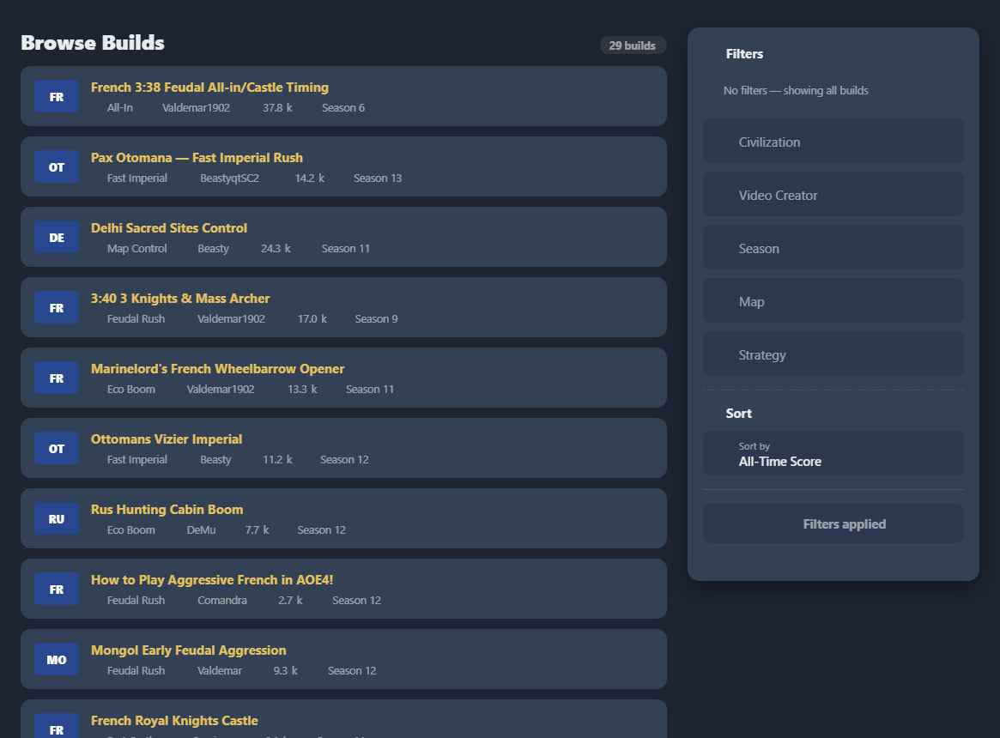
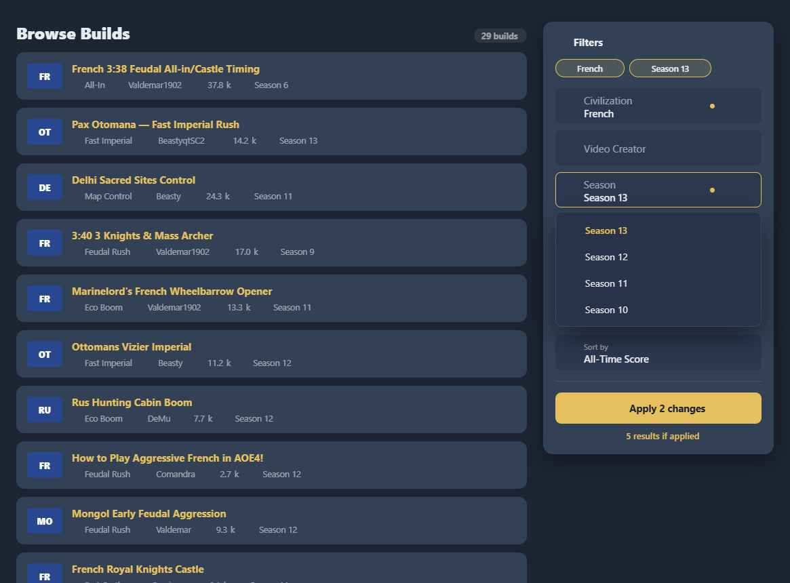
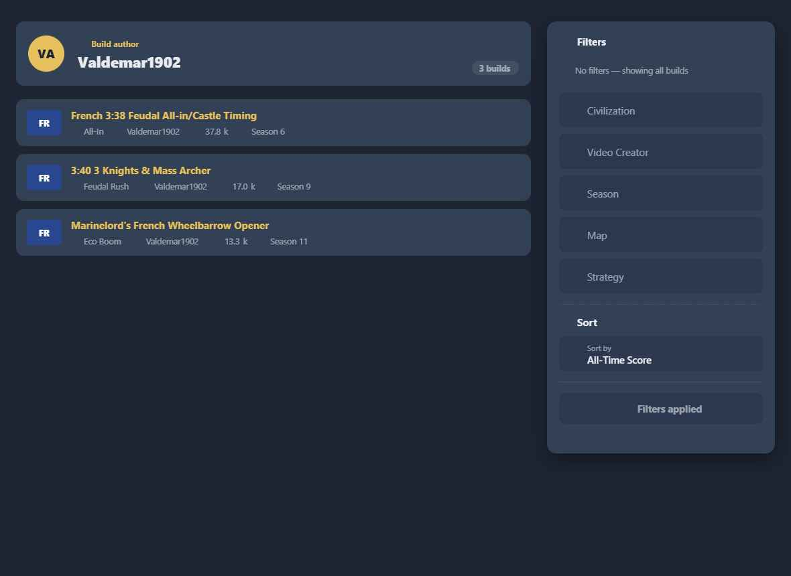
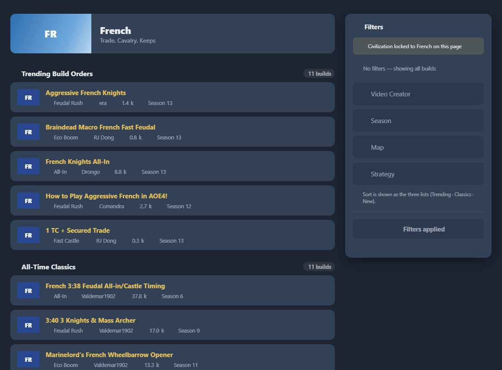
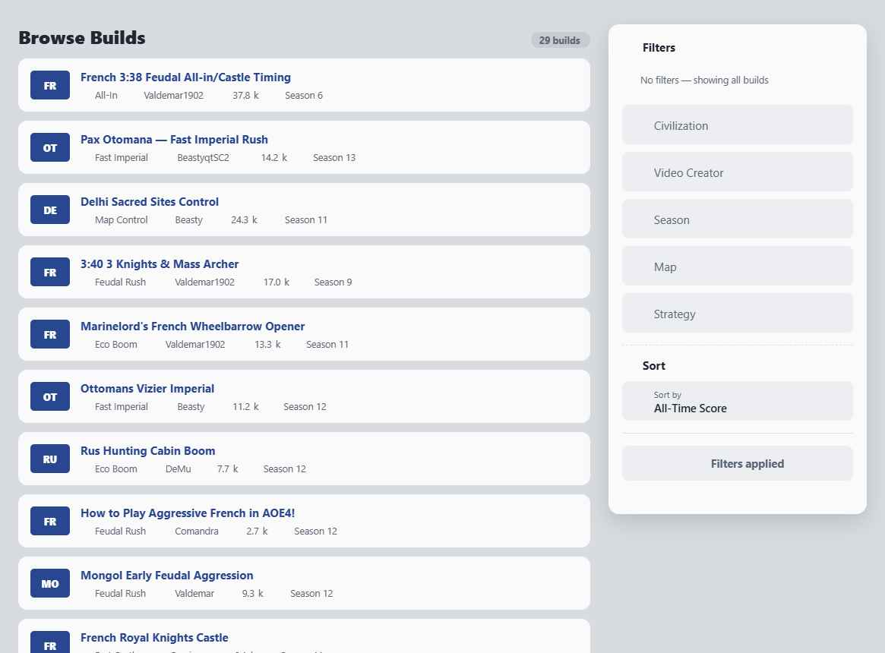

# Feature Specification: Filter UX Redesign

**Feature Branch**: `008-filter-ux`

**Created**: 2026-06-05

**Status**: Draft

**Input**: Redesign the build-order **filter experience** shared across every page that has a filter, keeping the apply-on-demand model (filtering only runs on **Apply**, to avoid intermediate Firestore document fetches). Add an **active-filter chips** row, a **sticky apply bar** with a **live count preview**, **pending-change** indicators, and a **separated Sort** group. Apply the redesigned **filter bar** to all filtered pages, and replace the small contributor strip currently inside the filter column with a proper **page header** (author hero on the author page; civ header on the civ page). Three contexts:

1. **Default** — all filters editable: *All Builds*, *My Builds*, *My Favorites*, *Dashboard*, etc.
2. **Civ-locked** — civilization pre-selected and not editable; reduced filter set; sort hidden (the page already shows the three sorted lists Trending · Classics · New, each with its own count).
3. **Author-locked** — author pre-selected (author was never a filter control here); all other filters editable; author shown as a page header.

> **Out of scope:** the **build list card** (`BuildListCard.vue`) is **not** changed. This feature is the filter bar, the chips/apply/preview/sort states, the count placement, and the page headers — not the cards.

> **Deferred (noted, not done here):** the tabbed-lanes layout for the civ page (feature 006) and the broader header redesign. On the civ page today, put the **count on top of each of the three lists**; when 006 lands, move the count into the tab.

> **Design reference:** `Filter UX.html` (project root) + `assets/`. **Exact styling + the Vuetify component mapping in `css-reference.md`.** Built on the app's real Vuetify theme tokens (`reference/design-tokens.md`).

## Clarifications

### Session 2026-06-05
- Adaptation: Flat style — no `box-shadow` on the filter panel, chips row, apply bar, author/civ page headers, or count pill. Consistent with project convention (no shadow, no hover lift on new surfaces). The `panel shadow` token in `css-reference.md` is defined but MUST NOT be applied.
- Q: How does a user discard staged-but-unapplied changes? → A: **Per-section X** on each filter group clears that section's staged value. Individual chips are also directly removable. No global "Reset all" needed — there is nothing to "undo" until Apply is pressed.
- Q: Count pill placement on default context pages? → A: **Above the results list** — a standalone section header row (e.g., "N builds"), consistent with how per-list counts work on the civ page. General rule: **adhere to the design reference when in doubt**.

- Q: Live filtering or keep Apply? → A: **Keep Apply** (apply-on-demand) to avoid intermediate document fetches. All additions must respect this.
- Q: Count preview cost? → A: Use the **existing `getBuildsCount()`** aggregation (count only, no doc reads) on the draft config, debounced. Provide an "off" fallback that shows only the applied count.
- Q: The custom select boxes in the mock? → A: **Prototype-only.** Keep the existing Vuetify `v-autocomplete` / `v-select` controls; this feature wraps states around them.
- Q: Author page small header? → A: Author was never a filter here; **remove the in-column contributor strip and the "author locked" note**, show a proper author **page header** instead.
- Q: Civ page count? → A: **Count on top of each of the three lists** for now; migrate into the tab once 006 (tabbed lanes) lands.

## User Scenarios & Testing *(mandatory)*

### User Story 1 - See and remove active filters at a glance (Priority: P1) 🎯 MVP

A visitor on any filtered page sees a row of **chips** at the top of the filter panel showing exactly which filters are active, and can remove any one with a single click. An empty state ("No filters — showing all builds") makes "nothing is filtering" explicit.

**Why this priority**: Today there is no glanceable summary of what's filtering the results — you must scan every field. Chips are the single biggest clarity win and are independently shippable.

**Independent Test**: Apply some filters → chips appear (one per active value); clicking a chip's ✕ stages its removal; with no filters, the empty-state line shows.

**Acceptance Scenarios**:

1. **Given** active filters, **When** the panel renders, **Then** each active value is a removable chip (civ, creator, each season/map/strategy).
2. **Given** a chip, **When** its ✕ is clicked, **Then** that filter is staged for removal (and applied per the apply model).
3. **Given** no active filters, **When** the panel renders, **Then** a single muted "No filters — showing all builds" line shows instead of chips.
4. **Given** a staged-but-unapplied change, **When** chips render, **Then** the affected chip shows the pending treatment (tint + primary outline).

---

### User Story 2 - Stage changes, then Apply with confidence (Priority: P1)

A visitor changes several filters and sees, before committing: which fields changed (a pending dot), how many changes are staged ("Apply N changes"), and roughly how many results they'll get ("≈ N results if applied") — all without firing the full query until they press Apply.

**Why this priority**: The apply model's inherent weakness is delayed feedback. Pending indicators + a count preview restore confidence while preserving the read-saving model. Core of the redesign.

**Independent Test**: Change two filters → two fields show a pending dot, the (sticky) Apply button enables and reads "Apply 2 changes", and the preview shows "≈ N results if applied"; pressing Apply runs the query and the indicators clear.

**Acceptance Scenarios**:

1. **Given** a changed field, **When** it differs from the applied value, **Then** it shows a pending dot and its chip shows the pending treatment.
2. **Given** one or more staged changes, **When** the footer renders, **Then** the Apply button is enabled and labelled "Apply N changes"; with no changes it is disabled and reads "Filters applied".
3. **Given** staged changes and preview enabled, **When** they change, **Then** "≈ N results if applied" updates from `getBuildsCount(draft)` (debounced) **without fetching documents**.
4. **Given** the preview is disabled (setting), **When** rendered, **Then** only the applied count is shown ("N shown"), no preview.
5. **Given** Apply is pressed, **When** the query runs, **Then** results update, pending indicators clear, and the button returns to "Filters applied".
6. **Given** the panel scrolls, **When** the list is long, **Then** the Apply bar stays reachable (sticky) and never shifts layout by appearing/disappearing.

---

### User Story 3 - Separated Sort + consistent count (Priority: P2)

Sorting is visually separated from filtering (it reorders, it doesn't filter), and the result count is presented identically everywhere (one tonal pill), shown once per page on the page-identity element.

**Why this priority**: Reduces the conflation of "sort" with "filter", and removes the three different count treatments that existed across pages.

**Independent Test**: The Sort control sits under a labelled "Sort" group separated by a divider; the count appears as the same pill on the main list header, the author header, and atop each civ list.

**Acceptance Scenarios**:

1. **Given** the default context, **When** the panel renders, **Then** Sort is in its own group (divider + "Sort" header matching the panel header style), below the filters.
2. **Given** any context, **When** the count renders, **Then** it uses the same tonal pill and appears exactly once on the page-identity element.
3. **Given** the civ context, **When** rendered, **Then** Sort is **hidden** from the panel and the count appears on top of each of the three lists.

---

### User Story 4 - Context variants: default / civ-locked / author-locked (Priority: P1)

The same filter bar adapts per page: default shows all filters; civ-locked hides the civ field (with a short "locked" note) and hides sort; author-locked keeps all filters and shows the author as a page header (no civ/sort changes, no "author locked" note).

**Why this priority**: The bar is reused across many pages; the locked variants must be correct and consistent or the redesign can't roll out everywhere.

**Independent Test**: On a civ page the civ field is absent + a "Civilization locked to X" note shows + sort is hidden + per-list counts; on an author page the author hero replaces the old in-column strip, no lock note, all filters present.

**Acceptance Scenarios**:

1. **Given** the civ-locked context, **When** the panel renders, **Then** the Civilization field is omitted, a concise "Civilization locked to <Civ> on this page" note shows, and Sort is hidden.
2. **Given** the author-locked context, **When** the page renders, **Then** a proper author **page header** (avatar/initials, "Build author", name, count) appears in the main column, replacing the old in-filter-column contributor strip; **no** "author locked" note is shown (author was never a filter control here).
3. **Given** the author-locked context, **When** the panel renders, **Then** all filters (incl. Civilization) and Sort are available and editable.
4. **Given** the default context, **When** the panel renders, **Then** all filters + Sort are present, no headers/locks.

---

### Edge Cases

- **No results after Apply** → existing `NoFilterResults` empty state in the results column.
- **Preview = 0** → "≈ 0 results if applied" (valid; user can still apply or adjust).
- **Rapid edits** → preview debounced (~300ms) so it doesn't spam `getBuildsCount`.
- **Long chip set** → chips wrap; panel grows; sticky footer stays pinned.
- **Mobile** → panel moves above the list (not sticky); chips + apply remain usable.
- **Author with no avatar** → initials fallback in the header.
- **Both light & dark** → field-hover stays lighter than the panel surface; count pill legible on bg and surface.

## Requirements *(mandatory)*

- **FR-001**: The filter MUST keep apply-on-demand — editing fields/chips changes a **draft** only and MUST NOT trigger document fetches; the full query runs on **Apply**.
- **FR-002**: The panel MUST show an **active-filter chips** row (one removable chip per active value) with an empty-state line when no filters are active.
- **FR-003**: Removing a chip MUST stage that filter's removal (committed on Apply per the model).
- **FR-004**: Changed-but-unapplied facets MUST show a **pending** indicator (field dot + chip tint/outline).
- **FR-005**: The footer MUST contain a **sticky Apply bar**, always present (no layout shift), enabled only when draft ≠ applied, labelled "Apply N changes" / disabled "Filters applied". There is NO global "Reset all" button — staged changes are discarded per-section via the section's own **X** control, or by removing chips individually.
- **FR-006**: A **count preview** ("≈ N results if applied") MUST be derivable from the existing `getBuildsCount(draft)` aggregation (debounced, no document reads); a setting MUST allow disabling it (show applied count only).
- **FR-007**: **Sort** MUST be visually separated from filters (own group, divider, header matching the panel header) in default/author contexts, and **hidden** in the civ context.
- **FR-008**: The result count MUST use one consistent tonal-pill treatment. On **default context** pages it appears **above the results list** as a standalone section header row (e.g., "N builds"). On the **author page** it appears in the author page header. On the **civ page** it appears **on top of each of the three lists**. Appears exactly once per page. When in doubt, adhere to `Filter UX.html` design reference.
- **FR-009**: The bar MUST support three contexts — **default** (all filters), **civ-locked** (no civ field, "locked" note, no sort), **author-locked** (all filters, author page header, no lock note).
- **FR-010**: The author **page header** MUST replace the in-filter-column contributor strip (and its duplicated mobile/desktop copies) and the "author locked" note MUST be removed.
- **FR-011**: All controls MUST remain the existing Vuetify components (`v-autocomplete`, `v-select multiple chips`, `v-select`); this feature MUST NOT introduce custom select widgets.
- **FR-011b**: All new surfaces (filter panel column, chips row, apply bar, author/civ page headers, count pill) MUST be rendered **flat** — no `box-shadow` applied, consistent with the project's no-shadow convention.
- **FR-012**: The field **hover** state MUST be visually distinct from the panel surface (lighter + inset border) in both themes.
- **FR-013**: The feature MUST render correctly in light and dark and MUST NOT change `BuildListCard` or data sourcing beyond using the existing count aggregation.
- **FR-014**: (Bug fix, in-scope) Restore the video-creator filter on mount — `FilterConfig.vue onMounted` reads `store.state.filterConfig.creat` (typo) instead of `creator`.

### Key Entities

- *No new entities.* Draft vs applied are two instances of the existing `filterConfig` shape (civ, creator, seasons[], maps[], strategies[], orderBy). Author/civ header data comes from the existing `contributor` object and civ provider.

## Success Criteria *(mandatory)*

- **SC-001**: A visitor can tell what's filtering at a glance (chips) and remove any filter in one click.
- **SC-002**: Before applying, the visitor sees which fields changed, how many changes, and ≈ how many results — with **zero document fetches** until Apply.
- **SC-003**: The Apply bar never shifts layout and is always reachable while scrolling.
- **SC-004**: Sort is clearly not a filter; the count looks identical across all three contexts and is shown once per page (per-list on civ).
- **SC-005**: All three contexts render correctly; the author page shows a real header (old in-column strip gone) with no lock note.
- **SC-006**: No custom select widgets introduced; controls remain Vuetify. `BuildListCard` untouched. The `creat` bug is fixed.
- **SC-007**: Correct in light and dark; field hover is distinct from the panel surface.

## Assumptions

- Built with Vuetify + existing theme tokens (Constitution III). The mock's custom select boxes are prototype-only; see `css-reference.md` §7 for the component mapping.
- `getBuildsCount(filterConfig)` already exists and is already used on apply in `Builds.vue` — the preview reuses it on the draft config; no new reads model.
- The filter bar is shared via `FilterConfig.vue`, hosted by `Builds.vue`, `MyBuilds.vue`, `MyFavorites.vue`, `Dashboard.vue`, and the civ page; the redesign lands in the shared component plus per-host header/context wiring.
- Civ tabbed-lanes (006) and the broader header redesign are deferred; per-list counts are the interim civ-page treatment.

## Design Reference

**Default — no filters** (chips empty-state, separated Sort, sticky "Filters applied")

**Default — staged** (chips French + Season 13, pending dots, "Apply 2 changes", "≈ 5 results if applied")

**Author-locked** (author page header replaces the in-column strip; all filters editable; no lock note)

**Civ-locked** (no civ field + "locked" note, sort hidden, count on top of each of the three lists)

**Light theme** (navy primary; field hover distinct from surface)

Exact styling + Vuetify mapping: **`css-reference.md`**. Interactive: `Filter UX.html` (Tweaks → context, theme, count preview on/off, chips, sort placement).
