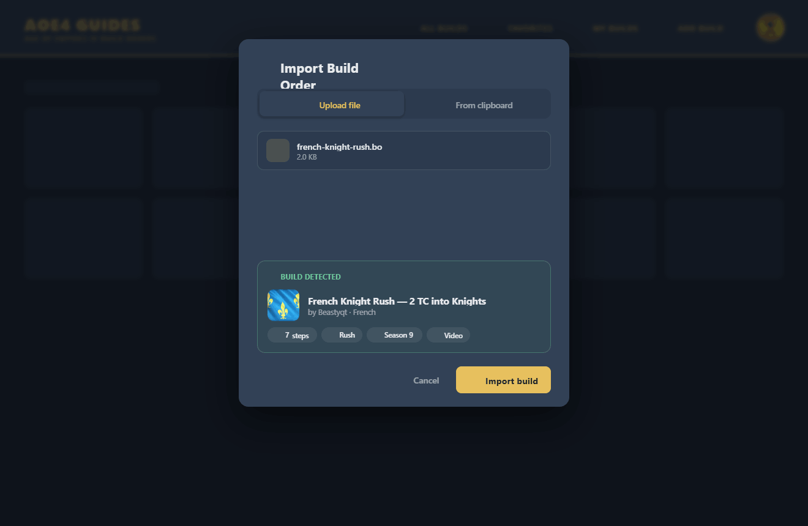
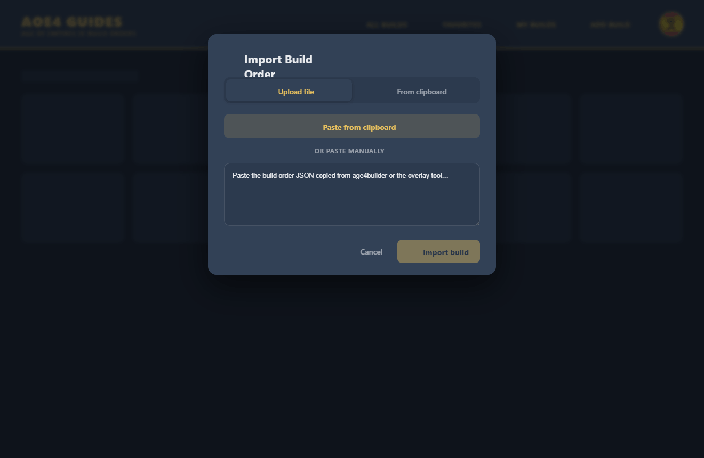
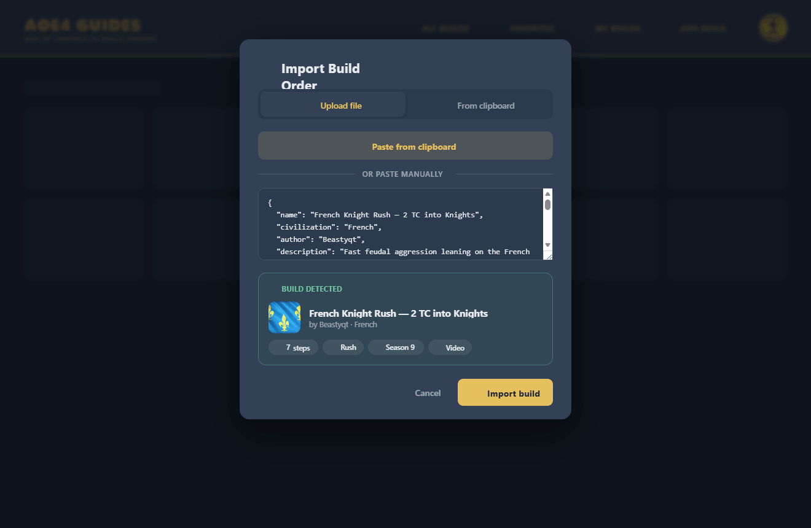
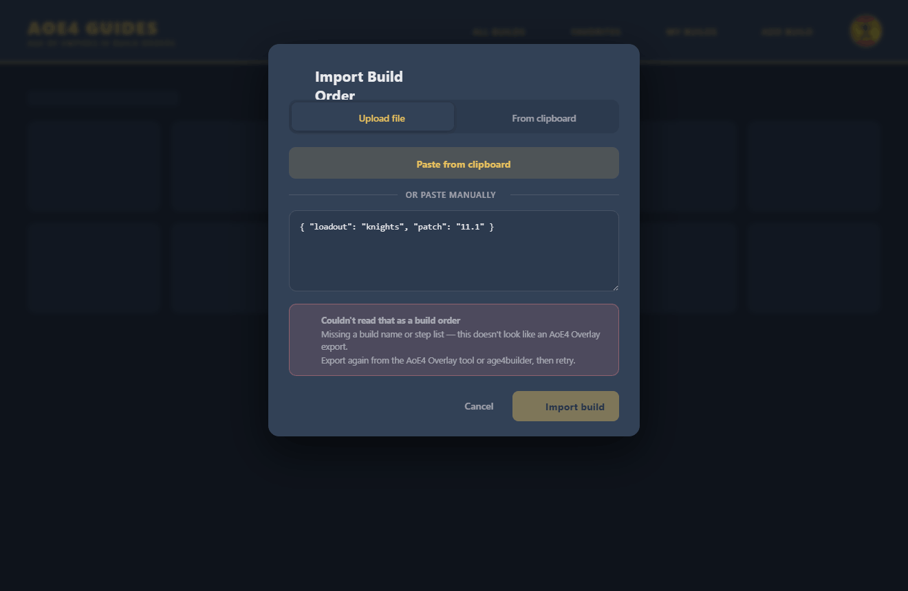
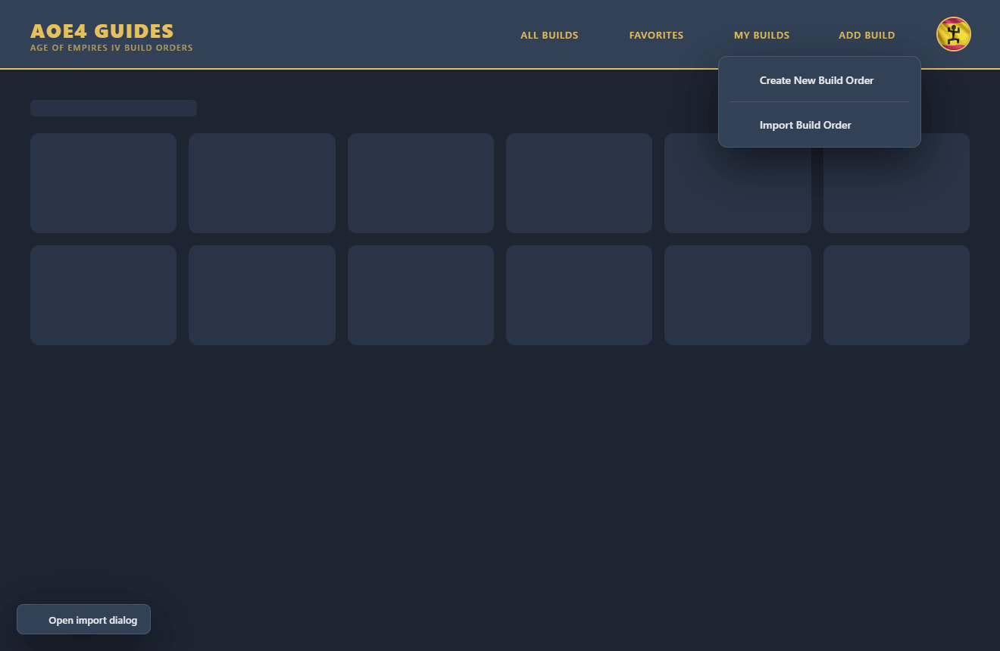
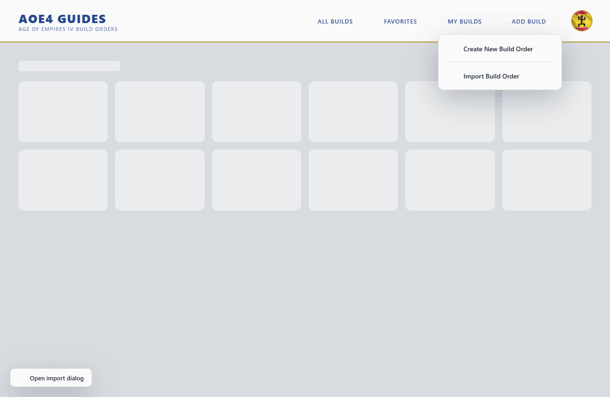

# Feature Specification: Import Build Order — unified dialog (reuses the avatar-picker shell)

**Feature Branch**: `009-import-build-order-dialog`

**Created**: 2026-06-08

**Status**: Implemented

**Input**: The "Add Build" menu has two import entries — **Import from File** and **Import from Clipboard** — that both navigate to the full-page route `/import/:paste?` (`BuildImport.vue`). File import shows a bare drop zone on its own page; clipboard import is the *same* route with `paste=true`, which reads the clipboard **on mount with no UI at all** (a blank page that either silently succeeds and routes away, or throws a snackbar error). Replace both with a **single dialog** — styled and structured exactly like the **avatar-image picker** (`AvatarPicker.vue`) — that merges file + clipboard into one flow with proper validation, a detected-build **preview**, and inline error handling. **Reuse the avatar dialog's container, do not duplicate it.**

> **Core constraint (Constitution III — Component Reuse):** the new dialog MUST be built on the **same dialog shell and drop-zone** as `AvatarPicker.vue`, not a second bespoke dialog. The plan extracts a shared `PickerDialog.vue` (dialog chrome: `v-dialog` + `v-card` + title/close + `v-tabs` + `v-card-actions`) and a shared `FileDropZone.vue` from `AvatarPicker`, refactors `AvatarPicker` onto them (atomic refactor), then builds `BuildImportDialog.vue` on the same two components.

> **Design reference:** `Import UX.html` (project root) + `assets/`. Exact Vuetify component mapping in `css-reference.md`. Built on the app's real theme tokens (`reference/design-tokens.md`).

> **Out of scope:** the build **conversion logic** itself (`useImportOverlayFormat`) and the downstream `BuildNew` editor are unchanged — this feature changes *how the user gets a parsed build into that pipeline*, not the pipeline. No change to export, Firestore, or rules.

## Clarifications

### Session 2026-06-08
- Q: New dialog or reuse the avatar one? → A: **Reuse.** Extract the avatar dialog's shell + drop zone into shared components; the import dialog and the avatar picker both consume them. Refactoring `AvatarPicker` onto the shared shell is in scope and is a separate atomic commit.
- Q: Keep the `/import/:paste?` route? → A: **Remove** the route + `BuildImport.vue`. Trigger the dialog from the Add Build menu via a Vuex-controlled open state, mirroring the existing **AuthDialog** pattern (`openAuthDialog`).
- Q: Does the AoE4 Overlay tool or any external link deep-link to `/import`? → A: **No** — delete the route and `BuildImport.vue` outright; no redirect needed.
- Q: One menu entry or keep two? → A: **One** — "Import Build Order" — opening the dialog on the File tab. (The interactive mock keeps a "split" variant as a tweak; default is single.)
- Q: Import immediately (today's behavior) or confirm? → A: **Confirm with a preview** by default — show the detected build (civ, title, author, step count) before creating the draft. Provide the immediate path as the non-confirm fallback.
- Q: Clipboard read fails (Safari/Firefox permissions, non-secure context)? → A: Always offer a **manual paste textarea** as well as the one-click "Paste from clipboard" button, so the flow never dead-ends. This is the biggest correctness win over today's blind read.
- Q: [NEEDS CLARIFICATION] Does the AoE4 Overlay tool / any external link deep-link to `/import`? If yes, keep `/import` as a redirect that opens the dialog; if no, delete the route outright.

## User Scenarios & Testing *(mandatory)*

### User Story 1 - One dialog for both sources (Priority: P1) 🎯 MVP

From the Add Build menu, a signed-in user clicks **Import Build Order** and gets a single dialog — same look and feel as the avatar-image picker — with two tabs: **Upload file** and **From clipboard**. They never leave the page they were on.

**Why this priority**: Collapsing two routes (one of which renders a blank page) into one familiar dialog is the whole point; it's the smallest shippable slice that delivers the value.

**Independent Test**: Click Import Build Order → a dialog opens over the current page (no navigation) with Upload file / From clipboard tabs, a Cancel and an Import action, and a close button — visually identical chrome to the avatar picker.

**Acceptance Scenarios**:

1. **Given** the Add Build menu, **When** "Import Build Order" is clicked, **Then** a dialog opens **in place** (no route change) using the shared `PickerDialog` shell.
2. **Given** the dialog, **When** it renders, **Then** it has an "Upload file" tab and a "From clipboard" tab, and a footer with Cancel + a primary Import action (disabled until a valid build is detected).
3. **Given** the dialog open, **When** Cancel / Esc / scrim-click / close-✕, **Then** it closes and discards any staged input.
4. **Given** the avatar picker, **When** it is opened after this change, **Then** it still works identically (it now consumes the same shared shell).

---

### User Story 2 - Upload a file by drag-drop or browse, with a preview (Priority: P1)

On the **Upload file** tab, the user drops an `AoE4_Overlay` `.json`/`.bo` file onto a drop zone (or clicks to browse). The file is parsed and validated; a **"Build detected"** preview card shows the civilization crest, title, author, and step count. They confirm with **Import build**, which creates the draft and opens the editor.

**Why this priority**: File import is the primary path; the drop zone is the explicit ask ("same style as the upload user avatar img including drop zone") and the preview is the "proper handling" upgrade.

**Independent Test**: Drop a valid overlay file → file chip + "Build detected" preview (civ flag, title, author, N steps); click Import build → snackbar "Build order imported…" and navigation to the build editor with the template loaded.

**Acceptance Scenarios**:

1. **Given** the Upload tab, **When** a file is dragged over the drop zone, **Then** it shows the active/dragging treatment; on drop the file is read.
2. **Given** a dropped/browsed `.json`/`.bo`, **When** it parses as a valid overlay build, **Then** a file chip (name + size, removable) and a "Build detected" preview (civ flag, title, author, step count, optional strategy/season/video) render.
3. **Given** a valid preview, **When** Import build is clicked, **Then** `useImportOverlayFormat().convert()` runs, the template is committed (`setTemplate`), the success snackbar shows, and the app routes to `BuildNew`.
4. **Given** a selected file, **When** the chip's ✕ is clicked, **Then** the file clears and the drop zone returns.

---

### User Story 3 - Paste from clipboard with a manual fallback (Priority: P1)

On the **From clipboard** tab, the user clicks **Paste from clipboard** (one-click `navigator.clipboard.readText`) **or** pastes into a textarea manually. The pasted JSON is validated live into the same "Build detected" preview, then imported.

**Why this priority**: Replaces today's blind, UI-less clipboard read that silently fails on permission-restricted browsers. The manual textarea guarantees the flow never dead-ends.

**Independent Test**: On the clipboard tab, click Paste from clipboard (grant permission) → textarea fills + preview; OR paste manually → preview; Import build → same import + route as US2.

**Acceptance Scenarios**:

1. **Given** the clipboard tab, **When** "Paste from clipboard" is clicked and permission is granted, **Then** the clipboard text fills the textarea and is parsed.
2. **Given** the clipboard read is blocked/denied/empty, **When** it fails, **Then** the flow does **not** dead-end: the manual textarea remains usable and a non-blocking hint is shown.
3. **Given** text in the textarea, **When** it parses as a valid overlay build, **Then** the same "Build detected" preview renders and Import build is enabled.

---

### User Story 4 - Inline validation & error handling (Priority: P2)

When the input isn't a valid overlay build (bad JSON, wrong shape, empty), the dialog shows an **inline error banner** ("Couldn't read that as a build order" + the specific reason) and keeps the Import action disabled — the user fixes it without the dialog closing.

**Why this priority**: Today an invalid clipboard/file throws a transient snackbar on a blank page with no way to retry in context. Inline, persistent, specific errors are the correctness upgrade.

**Independent Test**: Paste `{"loadout":"knights"}` → inline error "Missing a build name or step list…"; Import stays disabled; fix the text → error clears, preview appears.

**Acceptance Scenarios**:

1. **Given** invalid JSON, **When** parsed, **Then** an inline error banner shows "That isn't valid JSON…" and Import is disabled.
2. **Given** valid JSON of the wrong shape (no `name`/`build_order`), **When** parsed, **Then** the error explains it doesn't look like an AoE4 Overlay export.
3. **Given** an error is showing, **When** the input becomes valid, **Then** the error clears and the preview replaces it (dialog never closed).

### Edge Cases

- **Clipboard API unavailable** (non-HTTPS, Firefox default, Safari gesture rules) → manual textarea path; one-click button degrades gracefully.
- **Wrong file type** dropped (e.g. an image) → parse fails → inline error; no crash.
- **Huge / truncated file** → JSON.parse throws → inline error.
- **age4builder export** with image `@…@` note tokens → still parses (conversion of note tokens is the existing `convertNotes` behavior, unchanged).
- **Not signed in / unverified** → same guard as today (the route required `requiresAuth` + `requiresVerification`); the menu entry only shows for signed-in users, and the import action respects verification.
- **Both themes** → dialog chrome, drop zone, preview card, and error banner legible in light and dark.
- **Tab switch keeps state** → switching Upload ⇄ Clipboard does not lose a staged file or pasted text.

## Requirements *(mandatory)*

- **FR-001**: The two Add-Build entries (Import from File, Import from Clipboard) MUST be replaced by a **single "Import Build Order"** entry that opens a **dialog in place** (no navigation).
- **FR-002**: The dialog MUST be built on a **shared dialog shell reused with `AvatarPicker.vue`** — extract `PickerDialog.vue` (and `FileDropZone.vue`) and refactor `AvatarPicker` onto them; the import dialog MUST NOT be a duplicated, independent dialog.
- **FR-003**: The dialog MUST provide two sources via tabs: **Upload file** (drag-drop + browse, accepts `.json`,`.bo`) and **From clipboard** (one-click read **and** a manual paste textarea).
- **FR-004**: Input from either source MUST be validated; a valid AoE4 Overlay/age4builder build MUST surface a **"Build detected" preview** (civ crest, title, author, step count; optional strategy/season/video) before import.
- **FR-005**: Confirming MUST run the existing `useImportOverlayFormat().convert()`, commit via the existing `setTemplate`, show the existing success snackbar, and route to `BuildNew` — i.e. reuse today's import pipeline unchanged.
- **FR-006**: Invalid input MUST show a **persistent inline error** with a specific reason and keep Import disabled; the dialog MUST NOT close on error, and the error MUST clear when input becomes valid.
- **FR-007**: The clipboard path MUST degrade gracefully when the Clipboard API is blocked/denied — the **manual textarea** MUST always be available so the flow never dead-ends.
- **FR-008**: Switching tabs MUST preserve staged input (selected file / pasted text).
- **FR-009**: The `/import/:paste?` route and `BuildImport.vue` MUST be removed; the dialog open state MUST be Vuex-controlled, mirroring the existing **AuthDialog** pattern (action + `App.vue`-level mount). No external deep-links exist — delete the route outright, no redirect.
- **FR-010**: The feature MUST preserve the existing **auth/verification gate** (import requires a signed-in, verified user).
- **FR-011**: The dialog MUST render correctly in **light and dark** using existing theme tokens; all chrome MUST be Vuetify components (`v-dialog`, `v-tabs`, `v-window`, `v-card`, `v-btn`, `v-textarea`) per `css-reference.md`.

### Key Entities

- *No new entities.* Parsing yields the existing converted-build/template shape consumed by `setTemplate` → `BuildNew`. The "preview" is a read-only summary derived from the parsed overlay object (`name`, `civilization`, `author`, `build_order.length`, `strategy`, `season`, `video`).

## Success Criteria *(mandatory)*

- **SC-001**: A user imports a build (file **or** clipboard) without ever leaving their current page; no blank `/import` page is reachable.
- **SC-002**: Both paths show a confirmable preview of the detected build before a draft is created.
- **SC-003**: A blocked clipboard read never dead-ends — the manual textarea completes the task.
- **SC-004**: Invalid input produces a specific, inline, recoverable error (no transient-snackbar-on-blank-page).
- **SC-005**: The avatar picker and the import dialog visibly share one dialog shell + drop zone (single source of truth); `AvatarPicker` behaviour is unchanged after the refactor.
- **SC-006**: Correct in light and dark; all chrome is Vuetify; the import pipeline (`convert`/`setTemplate`/route) is reused unchanged.

## Assumptions

- Built with Vuetify 3 + existing theme tokens (Constitution III). The mock's hand-rolled dialog/segmented/drop-zone exist only because it's a framework-free HTML prototype; the implementation uses Vuetify components — see `css-reference.md` §Mapping.
- The existing `useImportOverlayFormat` composable, `setTemplate` mutation, success snackbar, and `BuildNew` route are reused as-is.
- An **AuthDialog**-style global dialog pattern already exists (`store.dispatch("openAuthDialog")`, mounted in `App.vue`) and is the model for the import dialog's open state.
- `AvatarPicker.vue` already contains the canonical dialog chrome + `.drop-zone` this feature generalizes; refactoring it onto the shared components is acceptable and is its own commit.
- The Add Build menu lives in `Header.vue`; it currently routes to `/import` and `/import/:paste`.

## Design Reference

**Upload file — valid file → preview** (file chip + "Build detected" + enabled Import)

**Upload file — empty drop zone** (drag-drop or click to browse; `.json`/`.bo`)

**From clipboard — paste → preview** (one-click read + manual textarea; live validation)

**Inline error** (unrecognized input; Import disabled; dialog stays open)

**Add Build menu** (single "Import Build Order" entry replacing the two old ones)

**Light theme**

> Icons in the static PNGs are MDI (`mdi-*`) glyphs that render live but don't rasterize in DOM captures — exact icon names are in `css-reference.md`. Interactive reference: `Import UX.html` (Tweaks → tabbed/unified layout, confirm-preview on/off, single/split menu, valid/unrecognized demo data, dark/light).
