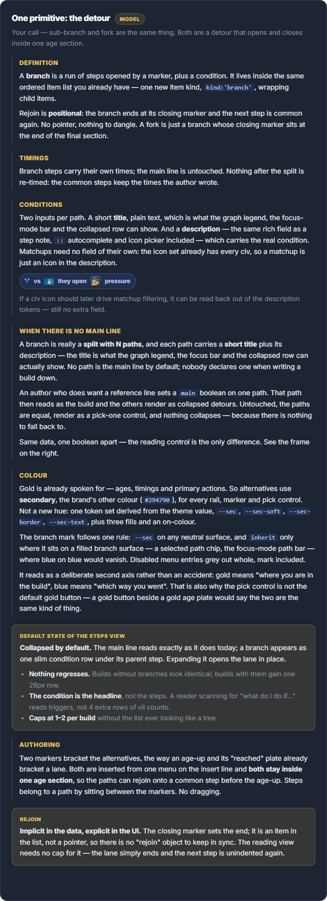
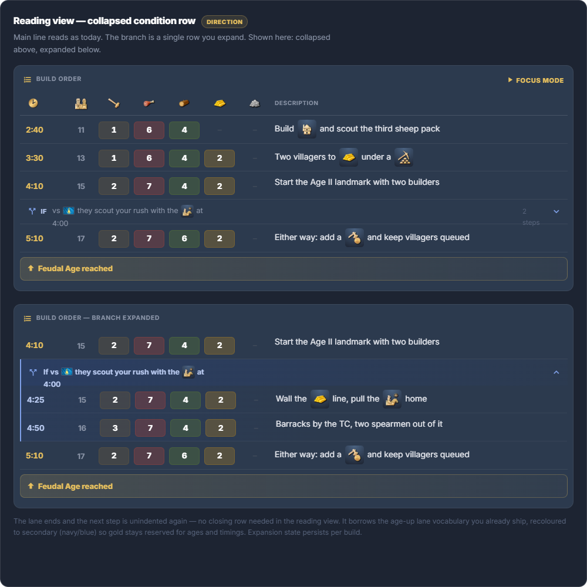
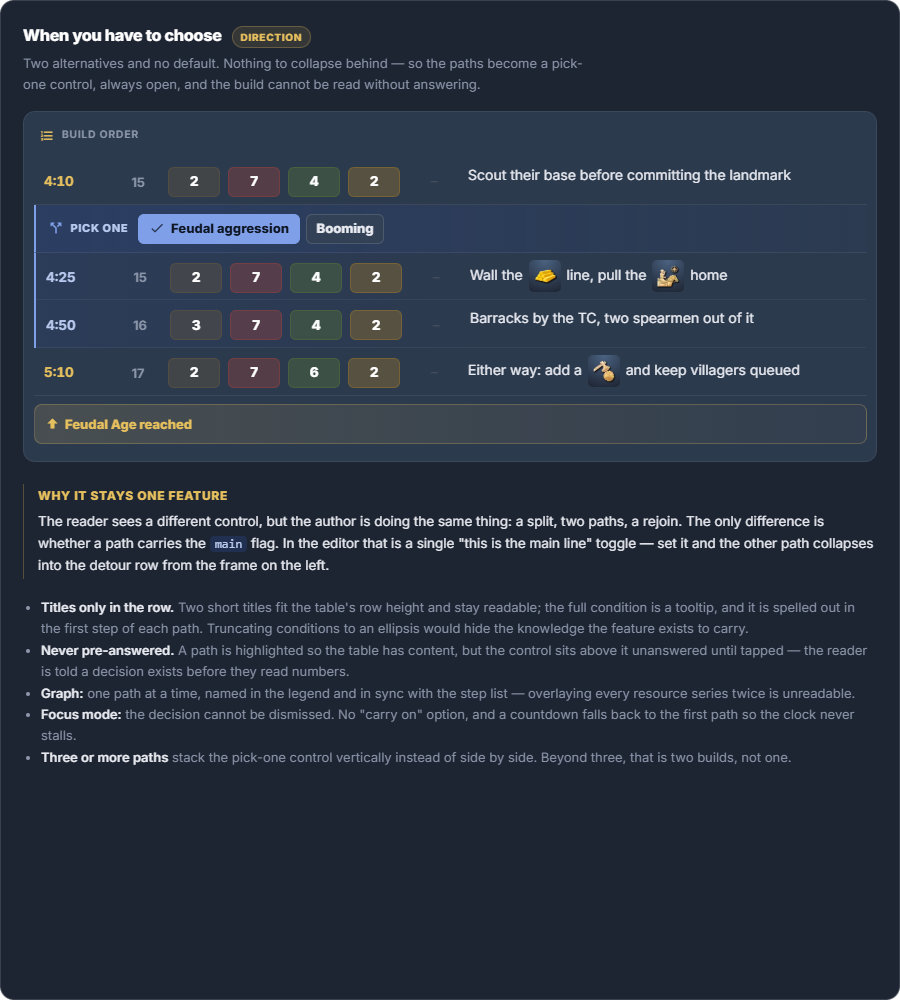
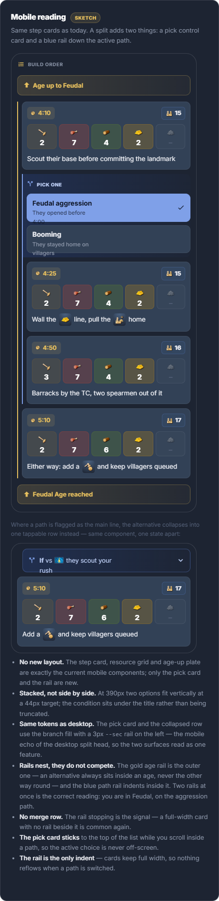
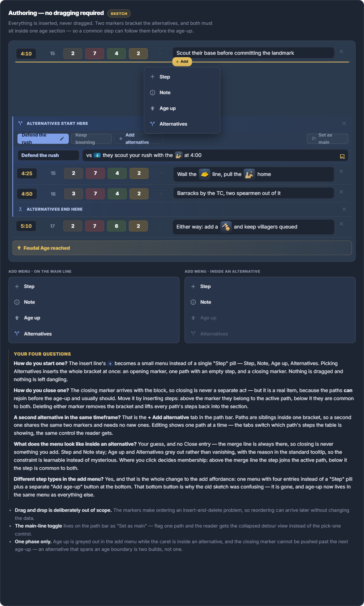
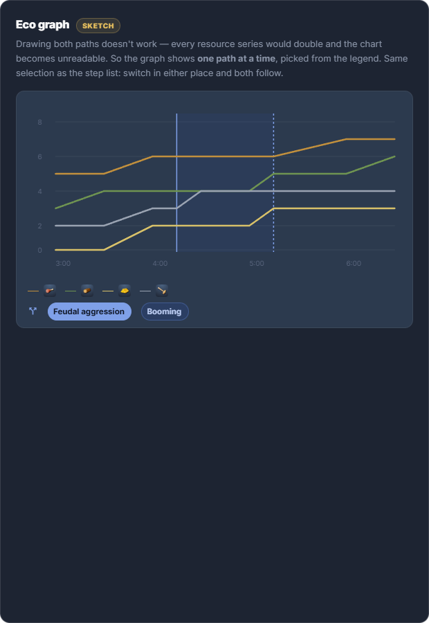
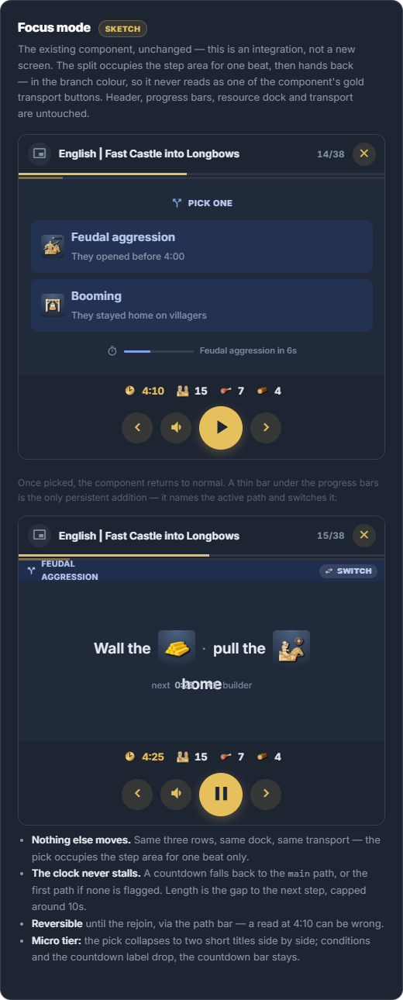

# Feature Specification: Build Order Alternatives

**Feature Branch**: `027-build-alternatives`

**Created**: 2026-08-08

**Status**: Draft

**Input**: Build orders are linear; real games are not. Let an author mark a point in a build where there are **two (or more) ways to play on**, describe the condition for each, and give each its own steps — then let a reader pick one and follow it through the step list, the economy graph, and focus mode. Design explored in the *Branch Annotations* canvas.

> **Scope guard:** this feature adds one new item kind to the build order document and the reading/editing/graph/focus-mode affordances for it. It does **not** change civilizations, filters, ratings, comments, or the home page. Drag-and-drop reordering of alternatives is explicitly **out of scope** (see Assumptions). *(True as written; delivered afterwards by [029-step-reordering](../029-step-reordering/spec.md) — see the Assumptions note.)*

> **Design reference:** the *Branch Annotations* canvas — seven frames: model, desktop reading view, pick-one split, mobile reading, editor, economy graph, focus mode. Captures of all seven are in `assets/` and inlined below. It forks the current-state designs of features 013, 014 and 023 (see Design Reference). The alternatives colour is the brand **secondary** (`#294790`) because gold is already spoken for by ages and timings.

## User Scenarios & Testing *(mandatory)*

### User Story 1 - Author two ways to play from one point (Priority: P1) 🎯 MVP

An author writing a Feudal all-in reaches 4:10 and wants to say "if they scouted you, defend; if they didn't, keep booming." They open the insert menu, choose **Alternatives**, and get a bracketed block with one path. They title it, describe the condition with icons, add its steps, then add a second alternative and do the same. A common step follows the block before the age-up.

**Why this priority**: Without authoring there is nothing to read. This is the whole feature's foundation and is independently shippable (the reader can be shown a flattened view until Story 2 lands).

**Independent Test**: In the build editor, insert an Alternatives block, name both paths on their tabs, write each one's condition in its first note, add steps, add a common step after the block, save, reload → the block and both paths persist intact.

**Acceptance Scenarios**:

1. **Given** the insert line in the build editor, **When** the author opens the add menu, **Then** it offers **Step**, **Note**, **Age up**, and **Alternatives** (replacing the current bottom-anchored add buttons).
1a. **Given** the author picks **Note**, **When** it is inserted, **Then** a note is placed **at that position** — not appended to the end of the section — and it is the same rich field as a step description.
1b. **Given** a section with no note, **When** the author edits it, **Then** **no empty note row is shown at all**. A note exists because the author asked for one.
2. **Given** the author picks **Alternatives**, **When** the block is inserted, **Then** an opening marker, **two** named paths — each holding an empty **note** and an empty step — and a closing merge marker are inserted together. That note is the path's condition (FR-022). *(Two, not one: a block is a fork, and one alternative is a run of steps with a label on it.)*
3. **Given** an alternatives block, **When** the author uses **+ Add alternative**, **Then** a second path is created sharing the same two markers, and path tabs let the author switch which path's steps are being edited.
4. **Given** a path, **When** the author renames it, **Then** the name is edited **on its tab**, in place (FR-023); its condition is its first note, written in the ordinary note field with `::` autocomplete and the icon picker (FR-022).
5. **Given** the caret is inside an alternative, **When** the add menu opens, **Then** **Age up** and **Alternatives** are shown **disabled** with the reason in a tooltip, and there is **no Close entry** (the merge line always exists).
6. **Given** an alternatives block, **When** the author inserts a step above the merge line, **Then** it joins the active path; **when** below, **then** it is common to all paths.
7. **Given** an alternatives block, **When** the author deletes either marker, **Then** the bracket is removed and every path's steps are lifted back into the section (not deleted).

---

### User Story 2 - Read a build and choose a path (Priority: P1)

A reader opens the build, reaches the split, sees "Pick one" with two titled options, taps one, and the following steps show that path's steps in a coloured lane. After the lane the build continues as common steps.

**Why this priority**: This is the payoff — the knowledge only helps if a reader can follow it. Depends on Story 1.

**Independent Test**: Open a build containing an alternatives block on desktop and on mobile → a pick control appears at the split, choosing a path renders that path's steps in a lane, and the steps after the block are shown regardless of choice.

**Acceptance Scenarios**:

1. **Given** a block, **When** the steps render, **Then** a **pick-one** row appears at the split showing each path's **title only** — its condition comes from the path's first note, shown in a tooltip and standing as the first row of the path once chosen — and no path's steps are hidden behind a disclosure.
2. **Given** a pick-one row on desktop, **When** rendered, **Then** it occupies the height of one table row and the option controls are auto-width, not stretched to fill.
3. **Given** a chosen path, **When** its steps render, **Then** they appear in a lane with a 3px secondary-coloured left rail, and the lane simply ends where the block ends (no closing cap in the reading view).
4. *(Withdrawn — the `main` flag was dropped during implementation, so there is no second reading state to switch into. The collapsed-detour view is deferred rather than designed out: it can return as a per-block author choice.)*
5. *(Withdrawn — nothing about a reading is remembered between visits. A choice depends on the matchup and on the game in front of you, so carrying the last one forward would answer a question the reader has not been asked yet, with a stale reading. Every visit starts from the author's first path.)*
6. **Given** mobile at 390px, **When** the pick control renders, **Then** options are stacked full-width with a minimum 44px target and the condition on a second line, sharing the step cards' width, radius and border.
7. **Given** mobile, **When** a path is active, **Then** its step cards sit inside a secondary-coloured rail that is continuous with the pick card's rail, nested **inside** the gold age rail.

---

### User Story 3 - See what a path costs in the economy graph (Priority: P2)

A reader comparing the two paths switches path in the graph legend and watches the villager/resource curves change across the split's time span.

**Why this priority**: The graph is where the price of a decision becomes visible, but the build is readable without it.

**Independent Test**: Open the economy graph for a build with an alternatives block → the legend offers the paths, exactly one path is drawn at a time, the split's span is shaded, and switching path in the step list changes the graph too.

**Acceptance Scenarios**:

1. **Given** a build with alternatives, **When** the graph renders, **Then** **one path at a time** is drawn (never both overlaid) and the path selector appears in the legend below the chart.
2. **Given** the graph and the step list are both visible, **When** the reader switches path in either, **Then** both follow the same selection.
3. **Given** a drawn path, **When** the chart renders, **Then** the split's time span is shaded and bounded by vertical markers, and resource series keep their existing colours and icons.
4. **Given** any block, **When** the graph first renders, **Then** it opens on the **first** path, which is the main line by convention.

---

### User Story 4 - Choose a path mid-game in focus mode (Priority: P2)

A player in focus mode reaches 4:10, is asked to pick, taps one, and keeps playing. If they don't tap, the clock does not stall.

**Why this priority**: Focus mode is where the branch knowledge is actually used, but it must not risk breaking the in-game timer, so it lands after the reading surfaces are stable.

**Independent Test**: Run focus mode through a build with an alternatives block → the pick appears at the split, the countdown falls back if untouched, the active path is named afterwards, and switching path mid-detour works.

**Acceptance Scenarios**:

1. **Given** focus mode reaches a split, **When** the pick appears, **Then** it occupies the step-content area only — header, progress bars, resource dock and transport controls do not move.
2. **Given** the pick is showing, **When** no option is tapped, **Then** a countdown falls back to the **first** path and auto-advance continues; the timer never stalls.
3. **Given** a path was picked, **When** the step content resumes, **Then** a thin bar names the active path and offers an explicit **switch** control.
4. **Given** the active path, **When** the player switches mid-detour, **Then** the queue re-reads from the new path's next step.
5. **Given** the pick control, **When** rendered, **Then** it uses the secondary (alternatives) colour, not gold, so it cannot be mistaken for a transport button.

---

### Edge Cases

- **Three or more paths** → the pick control stacks vertically instead of sitting side by side; beyond three the author should be told this is two builds, not one.
- **A path with zero steps** → the block still saves; the reading view shows the path as selectable with no steps (it is a legitimate "do nothing different" path).
- **A single path** → not reachable. Inserting creates two, and removing one of two dissolves the block onto the main line. A single-path block already in stored data still renders, as a plain run of steps.
- **Author tries to age up inside a path** → disabled in the add menu with the reason; the closing marker cannot be dragged/pushed past the next age-up.
- **Existing builds** → documents with no alternatives render byte-identical to today; no migration.
- **Overlay export** → a build with alternatives exports the **active path only** (flattened).
- **Focus mode micro tier** → the pick collapses to two short titles side by side; descriptions and countdown label drop, the countdown bar stays.
- **Very long condition** → never truncated into the pick row; the row shows titles only, and the condition is read in the path's first note.
- **A note with no other content** → kept, never treated as an empty step. A note *is* content; that is all it is.
- **An existing section note** → keeps rendering where it always did and stays editable. Only the empty row for sections that never had one goes away.

## Requirements *(mandatory)*

### Functional Requirements

- **FR-001**: The build order document MUST support one new item kind representing an **alternatives block**: an ordered run bounded by an opening marker and a closing merge marker, containing two or more **paths**, each with a plain-text `title` and its own ordered steps. *(Revised during implementation: a path carries no `description` field — its condition is its first note, see FR-022. The `main` boolean was dropped; the first path is the main line by convention.)*
- **FR-002**: Rejoin MUST be **positional** — the block ends at its closing marker and the next step is common again. There MUST be no rejoin pointer or cross-reference to keep in sync.
- **FR-003**: An alternatives block MUST open and close **within a single age section**; an age-up MUST NOT be creatable inside a path, and the closing marker MUST NOT be movable past the next age-up. Steps MAY follow the block before the age-up.
- **FR-004**: Alternatives blocks MUST NOT nest.
- **FR-005**: *(Revised during implementation.)* There is **no `main` flag**. The **first** path is the main line, in the order the author put them. One reading state, not two: the reader is always offered the pick. The collapsed-detour state is deferred along with the flag.
- **FR-006**: Each path MUST carry its own step timings. Steps after the block MUST NOT be re-timed by the presence or choice of a path.
- **FR-007**: The build editor's insert affordance MUST become a menu offering Step, Note, Age up and Alternatives, replacing the current bottom-anchored add buttons. Entries that are invalid in context MUST be shown **disabled with the reason in a tooltip** rather than hidden.
- **FR-008**: Choosing Alternatives MUST insert the complete bracket (opening marker, one path with one empty step, closing merge marker) in one action. There MUST be no separate "close" command.
- **FR-009**: The editor MUST provide path tabs to switch which path is being edited and an **+ Add alternative** action. Only one path's steps are edited at a time. *(The **Set as main** toggle is dropped with FR-005.)*
- **FR-010**: A path's condition MUST be written with the existing note field, including `::` shortcode autocomplete and the icon picker. Matchups MUST be expressed as civ icons inside it — no separate matchup field.
- **FR-011**: Deleting either marker MUST lift all paths' steps back into the section rather than deleting them.
- **FR-012**: The desktop steps table MUST render the pick-one control as a single table-row-height row showing **titles only**, with option controls sized to content; the active path's steps MUST render in a lane with a 3px secondary rail and no closing cap.
- **FR-013**: The mobile steps list MUST render the pick control as a card in the step flow with options stacked full-width at ≥44px, conditions on a second line, matching the step cards' width, radius and border; the active path's cards MUST sit in a continuous secondary rail nested inside the gold age rail.
- **FR-013a**: The mobile **editor** MUST render a block as a block — its markers, its path tabs and its steps. *(Added during implementation: markers currently fall through to the step-card branch and draw blank, editable cards, which is worse than absent.)*
- **FR-014**: The economy graph MUST draw **one path at a time**, selectable from a legend below the chart, MUST shade the split's time span, and MUST share a single active-path selection with the steps view.
- **FR-015**: Focus mode MUST present the pick in the step-content area without moving the header, progress bars, resource dock or transport controls; MUST fall back via countdown to the **first** path so auto-advance never stalls; MUST name the active path afterwards with an explicit switch control; and MUST allow switching until the rejoin.
- **FR-016**: All alternatives affordances MUST use the brand **secondary** colour role for rails, markers and controls, and MUST NOT use gold — gold denotes age/timing/primary action. The branch mark MUST be `mdi-call-split` and the close mark `mdi-call-merge`, used consistently and consistently coloured.
- **FR-017**: Builds without alternatives MUST render exactly as they do today, in light and dark themes, with no migration.
- **FR-018**: Overlay-tool export MUST remain functional for builds containing alternatives by exporting the active path flattened onto the main line.
- **FR-019**: A **note** MUST be an item the author inserts at a chosen position from the same menu, carried as a step whose content is its note text. A note MUST be exempt from the timing requirement that gates autoplay, MUST contribute no point to the economy series, and MUST show the resource position of the step it follows rather than stating one of its own.
- **FR-020**: Notes MUST be **optional and positional**. The editor MUST NOT render an empty note row for a section that has none; a section note that already exists MUST keep rendering and MUST stay editable where it is. No migration of existing notes.
- **FR-021**: Overlay-tool export MUST carry a note's text, so a note is not exported as an empty step.
- **FR-022**: A path's **condition** MUST be its **first note** rather than a field of its own. The editor MUST seed a new path with an empty note, so the convention holds by construction; a path whose first item is not a note MUST degrade to showing its title alone, never to an error. *(Added during implementation: the design already rendered the condition as the path's first step, so a separate field was the same text stored twice and cost the editor a row.)*
- **FR-023**: A path's title MUST be edited on its tab, which is where the title is displayed and where the reader switches paths.

### Key Entities

- **AlternativesBlock** — a build-order item: bounded by two markers, contains ≥2 paths, lives entirely inside one age section.
- **Path** — `title` (plain text, edited on its tab), `steps` (ordered, own timings). Its **condition is its first note**; there is no description field and no `main` flag (FR-022, FR-005).
- **Active path selection** — **view state, not build data**: held only while the page is open, never persisted; focus mode holds its own for the session; the graph reads it and does not own it.

## Success Criteria *(mandatory)*

### Measurable Outcomes

- **SC-001**: An author can express "two ways to play from here" with titles, icon-bearing conditions and separate steps, without any drag-and-drop, and reload it intact.
- **SC-002**: A reader on desktop and mobile can identify that a decision exists, choose a path, follow its steps, and see where the paths rejoin — without expanding anything in the pick-one state.
- **SC-003**: The economy graph never draws more than one path at a time, and its selection agrees with the steps view in both directions.
- **SC-004**: Focus mode never stalls the timer at a split, and the pick never displaces the header, dock or transport controls.
- **SC-005**: Builds with no alternatives are visually and functionally unchanged; no data migration is required.
- **SC-006**: No new colour, font or component vocabulary is introduced — alternatives are built entirely from the design system already in use.
- **SC-007**: A build that today shows **no economy chart** because its author wrote two variations one after another shows one once it is expressed as alternatives. *(Added during planning: authors are already doing this by hand and losing their chart to a guard that exists for exactly that shape — see research [R-3](./research.md#r-3--the-economy-chart-already-refuses-builds-that-contain-alternatives).)*

## Assumptions

- Built with Vuetify + existing theme tokens; no new dependency (Constitution Principle I & III). Pick controls = `v-btn-toggle` / `v-btn`; path tabs = `v-tabs` or `v-btn-toggle`; the insert menu = `v-menu` + `v-list`; markers and lanes = existing card/border patterns. The design HTML hand-rolled these; **the Vuetify equivalents win over the mock's markup.**
- The condition is written in the **existing** note field, reused as-is — not a new editor, and not a field of its own.
- **Notes become a first-class item kind** (FR-019…FR-021), decided during planning. The site's readers already understand a step whose content is a note — one exempts it from the autoplay timing gate, one keeps it out of the economy series, one shows it the previous step's resources — but nothing could ever create one. Notes were per-section and appeared automatically as an empty row at the end of every section in the editor. That row is now gone and a note is something the author inserts where they want it.
- **Drag-and-drop reordering of alternatives is out of scope.** The two-marker pattern makes ordering an insert-and-delete problem, so reordering can be added later without a data migration. **→ Delivered by [029-step-reordering](../029-step-reordering/spec.md), and the prediction held exactly.** Moving a step into or out of a path needed no new field, no marker rule and no migration — it is the same splice as moving it up two rows, because membership is position. The one thing 029 had to add was not about alternatives at all: sections do not share state, so crossing an *age* boundary needed a coordinator. Alternatives were the free part.
- Realistic volume is 2–3 paths per block and 1–2 blocks per build; the UI is designed for that, not for arbitrary depth.
- Overlay round-tripping (importing alternatives back from the overlay format) is **out of scope**; flattening on export is the v1 behaviour.
- Civ-based filtering from path conditions is **out of scope**; the data supports reading civs back out of the note's tokens later.
- Firestore schema change is additive (a new item kind inside the existing build document), so security rules need a review per Principle V but no new collection.

## Design Reference

The design is the *Branch Annotations* canvas — a pannable set of seven frames. **The interactive
HTML is not checked in**, so the static captures in `assets/`, inlined below, are the durable
record; treat them as authoritative. Reasoning behind each decision is in `design-input.md`.

It is a design reference authored in HTML, not production code: it hand-rolls menus, chips, buttons
and tabs that the app already solves with its component library. **Where it and the real components
disagree, the real components win** (Constitution Principle III) — port the decisions, not the CSS.

**The model** — data shape, rejoin, section scope, colour role, authoring pattern

**Desktop steps table — collapsed condition row** (design reference only — US2 §4 withdrawn with the `main` flag)

**Desktop steps table — pick-one** (the only reading state; US2 §1–3)

**Mobile steps list** (pick card, rail nesting, collapsed variant; US2 §6–7)

**Build editor** (add menu in both contexts, path tabs, markers; the frame's separate title and condition fields were superseded — see FR-022, FR-023; US1)

**Economy graph** (one path at a time, shaded span, legend selection; US3)

**Focus mode** (pick beat, countdown fallback, path bar; US4)

Current-state designs this one forks, each in its own feature's assets:

- `.specify/specs/014-desktop-build-layout/assets/Desktop Build Redesign.html`
- `.specify/specs/013-mobile-build-layout/assets/Mobile Build Redesign.html`
- `.specify/specs/023-focus-mode-pip/assets/Focus Mode PiP.html`

Real theme values come from the app's theme definition; the `#294790` above is the existing
**secondary** role, not a new colour.
